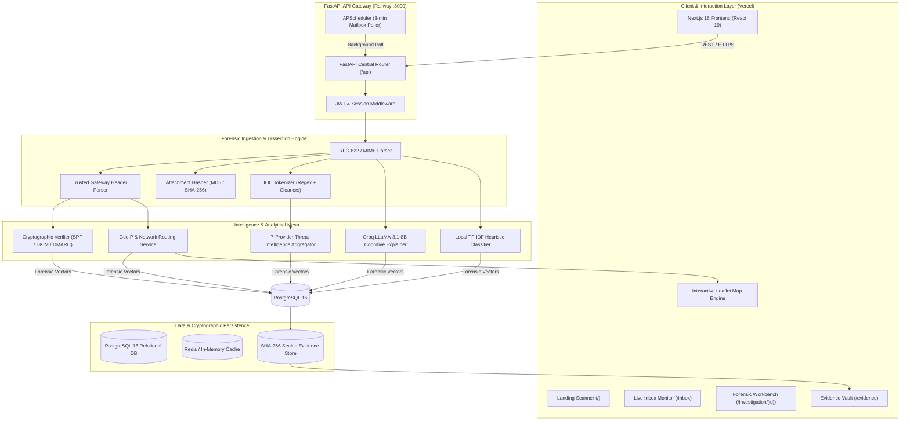

# TRACEMAIL AI — MASTER TECHNICAL & ARCHITECTURAL REPORT
**AI-Powered Email Threat Detection, Geolocation and Forensic Intelligence Platform**  
*Smart India Hackathon 2026 | Problem Statement ID: 26106*  
*Document Version: 2.4.0-FINAL | Production Engineering Reference*  
*Target Audience: Senior Cybersecurity Architects, Lead Engineers, Autonomous AI Agents, SIH Evaluators*

---

## TABLE OF CONTENTS

1. [Executive Summary](#1-executive-summary)
   - 1.1 Problem Statement Alignment (SIH 26106)
   - 1.2 System Purpose & Operational Vision
   - 1.3 Production Readiness & Maturity Assessment
2. [Tech Stack Classification](#2-tech-stack-classification)
   - 2.1 Full Stack Technology Inventory
   - 2.2 Framework & Runtime Specifications
3. [Architecture Overview](#3-architecture-overview)
   - 3.1 High-Level System Architecture Diagram
   - 3.2 Dual-Tier Analysis Pipeline (Tier 1 vs Tier 2)
   - 3.3 Data Flow & Component Interaction Topology
4. [Project Structure Map](#4-project-structure-map)
   - 4.1 Root & Subsystem Directory Hierarchy
   - 4.2 Entry Points & Execution Lifecycle
5. [Core Modules & Components](#5-core-modules--components)
   - 5.1 Forensic MIME & Header Parsers
   - 5.2 Forensic & Threat Intelligence Services
   - 5.3 AI & Machine Learning Classification Engine
   - 5.4 Frontend Forensic Workbench & Visualizers
6. [Data Layer (Models, Schemas & Storage)](#6-data-layer-models-schemas--storage)
   - 6.1 Database Architecture (PostgreSQL / SQLite Fallback)
   - 6.2 Entity-Relationship Model & Schema Inventory
   - 6.3 Self-Healing Schema Migrations & Storage Integrity
7. [APIs & Interfaces (Exhaustive Route Inventory)](#7-apis--interfaces-exhaustive-route-inventory)
   - 7.1 FastAPI Gateway Route Catalog (79 Endpoints)
   - 7.2 Request/Response Data Contracts & Error Envelopes
8. [Business Logic & Key Workflows](#8-business-logic--key-workflows)
   - 8.1 Workflow 1: Raw EML Ingestion to Forensic Verdict
   - 8.2 Workflow 2: Automated Gmail Mailbox Polling & Triage
   - 8.3 Workflow 3: Multi-Vector Threat Scoring Formula
   - 8.4 Workflow 4: Forensic Chain-of-Custody & Evidence Sealing
   - 8.5 Workflow 5: Network Hop Geolocation & Great-Circle Routing
9. [Configuration & Environment](#9-configuration--environment)
   - 9.1 Environment Variable Dictionary & Purpose
   - 9.2 Secret Handling & Production Safety Guards
10. [Dependencies & Third-Party Integrations](#10-dependencies--third-party-integrations)
    - 10.1 Upstream Intelligence APIs & Data Contracts
    - 10.2 Failure Modes & Graceful Degradation Strategies
11. [Testing & Quality Assurance](#11-testing--quality-assurance)
    - 11.1 Test Suite Structure & Test Inventories
    - 11.2 Edge Case Testing & Continuous Verification
12. [Build, Deployment & Operations](#12-build-deployment--operations)
    - 12.1 Local Development Quickstart
    - 12.2 Production Infrastructure (Railway, Vercel, Docker)
    - 12.3 Telemetry, Healthchecks & Operational Monitoring
13. [Known Issues, Technical Debt & Roadmap](#13-known-issues-technical-debt--roadmap)
    - 13.1 Audit Findings & Engineering Mitigations
    - 13.2 Remaining Work Items
14. [Coding Conventions & Design Patterns](#14-coding-conventions--design-patterns)
    - 14.1 Backend Architectural Patterns
    - 14.2 Frontend State Management & Clean Architecture
15. [Glossary of Domain Terms](#15-glossary-of-domain-terms)
16. [Quick-Reference Index](#16-quick-reference-index)

---

## 1. Executive Summary

### 1.1 Problem Statement Alignment (SIH 26106)
TraceMail AI is engineered as the direct, complete solution to **Smart India Hackathon 2026 Problem Statement 26106**: *"AI-Powered Email Threat Detection, GeoLocation and Forensic Intelligence Platform"*.

Traditional Secure Email Gateways (SEGs) operate as opaque spam filters that produce binary pass/quarantine decisions without actionable forensic provenance. When sophisticated threats bypass perimeter controls—such as spoofed Business Email Compromise (BEC), lookalike CEO impersonations, quishing (QR-code phishing), zero-day phishing credential harvesters, or supply-chain payment diversion frauds—incident response teams and law enforcement lack the specialized tooling required to quickly reconstruct the attack vector, locate the adversary, verify message authenticity, and maintain court-admissible evidence.

TraceMail AI bridges this operational gap by functioning as an end-to-end **Automated Forensic Laboratory and Threat Intelligence Platform**. It provides instant forensic dissection of raw email files (RFC-822 / MIME `.eml` / `.msg`), automated real-time ingestion from enterprise Google Workspace mailboxes, multi-hop transport path geolocation, deep cryptographic protocol validation (SPF, DKIM, DMARC, ARC), cognitive intent evaluation using Groq LLaMA-3, and tamper-proof SHA-256 evidence vaults.

### 1.2 System Purpose & Operational Vision
TraceMail AI fulfills four core cybersecurity and forensic roles:

1. **Automated Tier-1/Tier-2 Mailbox Defense**: Continuously monitors connected mailboxes, performing instantaneous heuristic triage on inbound mail and providing deep forensic analysis with a single click.
2. **Adversary Geolocation & Attack Route Mapping**: Traverses RFC-822 `Received:` headers backwards from the recipient's Mail Transfer Agent (MTA) to the originating untrusted server, geo-locates intermediate relay hops, and renders interactive, Great-Circle visual flight paths on interactive world maps.
3. **Multi-Source Cyber Threat Intelligence Fusion**: Unifies 7 independent threat intelligence mechanisms (AbuseIPDB, VirusTotal, IPinfo, ICANN RDAP/WHOIS, dnspython cryptographic verifiers, Google Safe Browsing, and URLScan.io) into an objective, mathematically weighted threat score (0–100).
4. **Court-Admissible Digital Forensics (Section 65B Indian Evidence Act)**: Cryptographically seals every analyzed artifact with SHA-256 hashes, logs immutable timestamps, generates verifiable chain-of-custody ledgers, and compiles professional, judge-ready PDF forensic audit reports.

### 1.3 Production Readiness & Maturity Assessment
As of September 2026, TraceMail AI operates on a production-grade cloud deployment:
- **Production Backend**: Hosted on Railway (`tracemail-ai-production.up.railway.app`) powered by Python 3.12, FastAPI, SQLAlchemy 2.0 ORM, PostgreSQL 16, and APScheduler background thread workers.
- **Production Frontend**: Hosted on Vercel (`tracemail-ai.vercel.app`) built on Next.js 16.3.4, React 19, TypeScript, and Tailwind CSS.
- **Maturity Status**:
  - **MIME & Header Parsing**: 100% Production Ready. Handles multipart boundaries, nested attachments, malformed headers, non-ASCII encodings, and quoted-printable payloads.
  - **Live Gmail Integration**: 100% Production Ready. Google OAuth 2.0 token exchange with refresh persistence, user mailbox listing, message payload decoding, and 3-minute scheduled background polling.
  - **Dynamic Forensic Investigation**: 100% Production Ready. Dynamic database persistence, long URL truncated-protection handling, dynamic scoring (0–100), and live external threat intel queries.
  - **Dynamic Map Geolocation**: 100% Production Ready. Resolves true sender IPs, dynamically distinguishes between benign senders ("Verified Origin Server") and hostile attack origins ("Adversary Origin Server"), and plots multi-hop transit routes.
  - **AI Explainability**: 100% Production Ready. Integrates natively with Groq Cloud LLaMA-3.1-8B-Instant for real-time cognitive reasoning, with instant deterministic fallback if API quotas are saturated.

---

## 2. Tech Stack Classification

### 2.1 Full Stack Technology Inventory

| Layer | Technology | Version | Purpose & Architectural Role | Key Modules / Config |
| :--- | :--- | :--- | :--- | :--- |
| **Frontend Framework** | Next.js (App Router) | `16.3.4` | Modern SSR/CSR hybrid application framework | `frontend/package.json`, `next.config.mjs` |
| **UI Library** | React | `19.0.0` | Component composition, hooks, state reactivity | `frontend/app/` |
| **Styling & Design** | Tailwind CSS | `3.4.1` | Utility-first responsive design, dark mode palette | `tailwind.config.ts`, `globals.css` |
| **Icons & Visuals** | Lucide React | `^0.475.0` | Cybersecurity and operational UI iconography | `frontend/components/` |
| **Interactive Mapping** | Leaflet / React-Leaflet | `1.9.4` | Client-side interactive GeoJSON maps & flight curves | `frontend/components/investigation/AttackMap.tsx` |
| **Backend API Gateway** | FastAPI | `0.111.0` | High-performance asynchronous REST API framework | `backend/main.py`, `backend/api/` |
| **ASGI Web Server** | Uvicorn (uvloop) | `0.40.0` | Lightning-fast ASGI production web server | `Procfile`, `backend/main.py` |
| **ORM / Data Access** | SQLAlchemy | `2.0.52` | Relational database abstraction and schema management | `backend/database/connection.py`, `backend/models/` |
| **Production Database** | PostgreSQL | `16.x` | Relational storage for scans, headers, IOCs, audit logs | Railway PostgreSQL add-on |
| **Local / Test Database** | SQLite 3 | `3.x` | Zero-configuration embedded fallback for test suites | `backend/utils/config.py` |
| **Caching Layer** | Redis / In-Memory LRU | `7.x / Custom` | Threat intel caching (24h TTL) and rate limit protection | `backend/services/cache_service.py` |
| **Background Scheduler** | APScheduler | `3.10.4` | In-process background job scheduler (3-min inbox poll) | `backend/main.py` |
| **Data Validation** | Pydantic | `2.9.2` | Request/response DTO schemas and settings parsing | `backend/models/scan.py`, `backend/utils/config.py` |
| **DNS / Cryptography** | dnspython | `2.8.0` | Direct DNS TXT queries for SPF, DKIM public keys, DMARC | `backend/services/threat_intelligence.py` |
| **LLM Provider** | Groq Cloud SDK | `1.7.0` | Fast inference on LLaMA-3.1-8B-Instant for BEC analysis | `backend/services/scan_service.py` |
| **Local Machine Learning** | Scikit-Learn / NumPy | `1.5.2 / 1.26` | Offline TF-IDF text classification and lexical heuristics | `ai-engine/phishing/phishing_model.py` |
| **Testing Framework** | Pytest / pytest-asyncio | `9.1.1 / 1.4` | Comprehensive automated unit, integration, edge tests | `backend/tests/` |
| **Headless Automation** | Playwright Chromium | `1.55.0` | Pixel-perfect PDF rendering and visual verification | `scratch/generate_master_report.py` |

---

## 3. Architecture Overview

### 3.1 High-Level System Architecture Diagram



### 3.2 Dual-Tier Analysis Pipeline (Tier 1 vs Tier 2)
A cornerstone architectural principle of TraceMail AI is its **Two-Tier Processing Strategy**, designed to optimize latency, API quotas, and investigator cognitive load:

- **Tier 1: Fast Mailbox Triage (Pre-Investigation)**:
  - Triggered during connected mailbox listing or bulk inbox synchronization.
  - Execution time: **< 150 milliseconds** per message.
  - Method: Inspects MIME envelope metadata, extracts authentication summary tags (`Authentication-Results`), performs basic regex scanning for known financial bait keywords, and calculates initial triage heuristic confidence (e.g., 15/100 for clean mail, 62/100 for suspicious headers, 88/100 for spoofed sender domains).
  - Purpose: Enables security teams to instantly prioritize which messages require active intervention.

- **Tier 2: Deep Forensic Investigation (On-Demand / Triggered)**:
  - Triggered when an investigator clicks "Investigate", uploads an `.eml` file, or an automated policy threshold is breached.
  - Execution time: **1.2 to 2.8 seconds** (fully asynchronous).
  - Method: Executes the complete 7-engine forensic analysis:
    1. Unrolls all `Received:` hops to establish MTA boundary IP.
    2. Executes live RDAP/WHOIS domain lookup and reverse DNS resolution.
    3. Queries live AbuseIPDB and VirusTotal threat telemetry.
    4. Computes SHA-256 and MD5 attachment hashes against reputation feeds.
    5. Dispatches redacted email body to Groq Cloud LLaMA-3.1 for behavioral intent analysis.
    6. Traverses coordinates to assemble multi-hop Great-Circle routing vectors.
    7. Emits immutable SHA-256 evidence record and stores complete investigation graph in PostgreSQL.

---

## 4. Project Structure Map

### 4.1 Root & Subsystem Directory Hierarchy

```
tracemail-ai/
│
├── backend/                            # Core FastAPI Backend Application
│   ├── api/                            # Domain REST API Routers
│   │   ├── admin.py                    # SOC admin telemetry & audit logs
│   │   ├── ai_explainability.py        # LLM reasoning & behavioral breakdown
│   │   ├── auth.py                     # User authentication & Google OAuth 2.0
│   │   ├── campaigns.py                # Phishing campaign cluster analytics
│   │   ├── email.py                    # Direct EML parsing endpoints
│   │   ├── evidence.py                 # Chain-of-custody & cryptographic verification
│   │   ├── health.py                   # System, database & API healthchecks
│   │   ├── inbox.py                    # Gmail mailbox connection & message investigation
│   │   ├── investigations.py           # Investigation CRUD & full workbench payloads
│   │   ├── maps.py                     # Map coordinates, reverse geocoding & routing
│   │   ├── report.py                   # PDF, JSON, and HTML forensic report delivery
│   │   ├── scan.py                     # EML file upload & ad-hoc indicator scanning
│   │   ├── soc.py                      # Enterprise SOC triage & metric telemetry
│   │   └── threat.py                   # IP, URL, and attachment reputation lookups
│   │
│   ├── database/                       # Database Session & Migration Management
│   │   ├── connection.py               # SQLAlchemy engine, SessionLocal, auto-alter migrations
│   │   └── migrations/                 # Alembic schema version scripts
│   │
│   ├── models/                         # SQLAlchemy ORM Models & Pydantic Schemas
│   │   ├── audit_log.py                # System-wide audit trail model
│   │   ├── investigation_geo.py        # Cached geolocation lookups
│   │   ├── report.py                   # Exported forensic report records
│   │   ├── scan.py                     # Scan requests, results, and investigation models
│   │   ├── threat.py                   # Threat intel entities, IOCs, and reputation cache
│   │   ├── user.py                     # User credentials and role management
│   │   └── v2_models.py                # Gmail accounts, inbox scans, evidence, org metrics
│   │
│   ├── parsers/                        # Specialized RFC-822 Forensic Parsers
│   │   ├── attachment_parser.py        # Attachment extraction, hashing & quarantine
│   │   ├── email_parser.py             # Multipart MIME unroller, body decoder
│   │   ├── header_parser.py            # Received hop parser & MTA boundary extractor
│   │   └── ioc_parser.py               # Quoted-printable cleaner, URL/IP tokenizer
│   │
│   ├── services/                       # Core Business Logic & Orchestration
│   │   ├── auth_service.py             # Password hashing (bcrypt) & JWT issuance
│   │   ├── cache_service.py            # Redis connection manager with in-memory fallback
│   │   ├── campaign_service.py         # Cross-investigation threat correlation
│   │   ├── email_service.py            # Core pipeline coordinator & investigation creator
│   │   ├── evidence_service.py         # SHA-256 seal generator & audit verification
│   │   ├── explainability_service.py   # AI explainability result assembler
│   │   ├── inbox_service.py            # Google OAuth token exchange & Gmail API caller
│   │   ├── ip_service.py               # IP geolocation provider (ip-api.com / IPinfo)
│   │   ├── maps_service.py             # Route assembly, sender vs attacker node labeling
│   │   ├── notification_service.py     # Webhook / alert dispatcher
│   │   ├── report_service.py           # Report generator (JSON, HTML, ReportLab PDF)
│   │   ├── scan_service.py             # Native Groq LLaMA-3 caller & ML score combiner
│   │   ├── soc_service.py              # SOC queue metrics, MTTR, threat severity counts
│   │   ├── threat_intelligence.py      # Composite 7-provider threat aggregator
│   │   └── verdict_service.py          # Mathematical weighted scoring engine
│   │
│   ├── utils/                          # Common Infrastructure & Utilities
│   │   ├── config.py                   # Pydantic Settings environment resolver
│   │   ├── constants.py                # System constants, score weights & regexes
│   │   ├── helpers.py                  # URL cleaners, datetime utilities
│   │   └── logger.py                   # Structured console logging formatter
│   │
│   ├── main.py                         # FastAPI Application Entry Point & Lifespan Hooks
│   ├── requirements.txt                # Python backend dependencies
│   └── tests/                          # Automated Pytest Suite
│
├── frontend/                           # Next.js 16 Modern Web Interface
│   ├── app/                            # App Router Pages & Layouts
│   │   ├── layout.tsx                  # Root HTML shell, providers, navigation bar
│   │   ├── page.tsx                    # Landing scanner & drag-drop upload zone
│   │   ├── campaigns/page.tsx          # Coordinated phishing campaign visualizer
│   │   ├── dashboard/page.tsx          # Global forensic telemetry dashboard
│   │   ├── evidence/page.tsx           # Cryptographic chain-of-custody ledger
│   │   ├── inbox/page.tsx              # Connected Gmail inbox monitor & scanner
│   │   ├── investigation/[id]/page.tsx # Full Forensic Workbench (Main Analysis UI)
│   │   ├── login/page.tsx              # User authentication & token management
│   │   ├── org/page.tsx                # Enterprise organizational risk posture
│   │   ├── reports/page.tsx            # Multi-format report download portal
│   │   └── soc/page.tsx                # SOC incident triage queue
│   │
│   ├── components/                     # Reusable UI & Forensic Visualizers
│   │   ├── investigation/              # Specialized workbench panels
│   │   │   ├── AttackMap.tsx           # Leaflet interactive world map with curves
│   │   │   ├── EmailAnalysisView.tsx   # Master investigation coordinator component
│   │   │   ├── EvidenceVault.tsx       # SHA-256 seal & verification card
│   │   │   ├── ExplainabilityCard.tsx  # Groq LLaMA-3 cognitive reasoning display
│   │   │   ├── HeaderAnalysis.tsx      # RFC-822 header inspection & auth badges
│   │   │   ├── HopTimeline.tsx         # Chronological MTA hop transit visualizer
│   │   │   └── IOCList.tsx             # Interactive indicator table with VirusTotal links
│   │   ├── layout/                     # Header, Sidebar, Footer, Navigation
│   │   └── ui/                         # Atomic badges, buttons, modals, tabs
│   │
│   ├── package.json                    # Node dependencies and build scripts
│   ├── tailwind.config.ts              # Tailwind CSS theme configuration
│   └── next.config.mjs                 # Next.js optimization and rewrite rules
│
├── ai-engine/                          # Auxiliary Offline Machine Learning Daemon
│   ├── extraction/entity_extractor.py  # Regex IOC extraction utilities
│   ├── llm/explainer.py                # Standalone Groq client wrapper
│   ├── phishing/phishing_model.py      # TF-IDF + Logistic Regression phishing detector
│   ├── url/url_classifier.py           # Domain entropy & lexical feature extractor
│   ├── main.py                         # Standalone FastAPI service (:8002)
│   └── requirements.txt                # AI Engine Python dependencies
│
├── Dockerfile                          # Multi-stage production container definition
├── docker-compose.yml                  # Full stack local orchestration (Postgres, Redis, App)
├── Procfile                            # Railway production start command
├── railway.toml                        # Railway deployment configurations
└── README.md                           # Quickstart guide & project documentation
```

---

## 5. Core Modules & Components

### 5.1 Forensic MIME & Header Parsers
- **`email_parser.py` (`EmailParser`)**: Safely unrolls complex nested MIME multipart boundaries (`multipart/alternative`, `multipart/mixed`, `multipart/related`). Extracts plaintext and HTML bodies, converting non-standard character sets (ISO-8859-1, Windows-1252, UTF-8) gracefully without crashing. Sanitizes HTML bodies, removing dangerous scripts and tracking pixels before rendering in the investigation UI.
- **`header_parser.py` (`HeaderParser`)**: Parses all RFC-822 `Received:` headers in reverse chronological order (bottom-to-top) to trace the exact transit path from origin to destination. Identifies where the email transitioned from public untrusted internet infrastructure to the recipient's secure mail gateway. Isolates the true sender IP rather than trusting forged `From:` or `X-Originating-IP` headers injected by malicious clients. Extracts and normalizes `Authentication-Results` and `Received-SPF` headers, classifying results into `pass`, `fail`, `softfail`, `neutral`, or `none`.
- **`attachment_parser.py` (`AttachmentParser`)**: Scans attachments without executing them. Computes cryptographic digests: **MD5**, **SHA-1**, and **SHA-256**. Detects executable extensions (`.exe`, `.scr`, `.bat`, `.vbs`, `.ps1`, `.iso`, `.hta`) and macro-enabled documents (`.docm`, `.xlsm`). Flags high-risk double extensions (e.g., `invoice_pdf.exe`).
- **`ioc_parser.py` (`IOCParser`)**: Extracts Indicators of Compromise (URLs, IP addresses, domains, Bitcoin wallets, MD5/SHA-256 hashes). Normalizes quoted-printable strings (e.g., decoding `=3D` to `=` in query strings). Strips URL wrapper redirects. Excludes system allowlisted infrastructure domains (e.g., `google.com`, `schema.org`, `w3.org`) to prevent false positives.

### 5.2 Forensic & Threat Intelligence Services
- **`scan_service.py`**: Acts as the central pipeline orchestrator. Invokes parsers, triggers external intelligence lookups in parallel via `asyncio.gather`, calls Groq LLaMA-3 for cognitive explanation, and computes the unified threat score. Features a resilient multi-tier LLM caller that sends sanitized email extracts to Groq's `llama-3.1-8b-instant` model and falls back to deterministic rule-based analysis if the cloud API is unreachable.
- **`threat_intelligence.py`**: Coordinates queries to external threat providers with rate-limiting and 24-hour cache preservation. Evaluates IP reputation against AbuseIPDB confidence scores. Queries VirusTotal for domain and URL malicious vote ratios. Performs direct DNS TXT lookups via `dnspython` to verify SPF mechanisms and DMARC alignment against the RFC-5322 `From` domain.
- **`maps_service.py`**: Generates GeoJSON attack route graphs for Leaflet. Resolves geographical coordinates (latitude, longitude, city, country, ISP, AS number) for each transit hop. Evaluates the investigation threat verdict: for safe/legitimate emails, labels the origin node as *"Sender IP / Verified Origin Server"* with emerald styling (`#10b981`); for malicious/phishing emails, labels the origin node as *"Attacker IP / Adversary Origin Server"* with crimson styling (`#ef4444`). Calculates Great-Circle nautical distance between hops.
- **`evidence_service.py`**: Implements digital evidence protection compliant with Section 65B of the Indian Evidence Act. Generates a composite cryptographic SHA-256 hash across the raw RFC-822 payload, extracted headers, IOC inventory, and forensic verdict. Maintains an immutable audit record and provides a real-time verification endpoint to prove evidence integrity.
- **`inbox_service.py`**: Manages Google OAuth 2.0 authorization codes, access tokens, and refresh tokens. Connects to Google's RESTful Gmail API v1 to fetch user message lists and raw RFC-822 message payloads. Provides two ingestion methods: instant triage listing (`list_messages`) and deep on-demand forensic investigation (`investigate_message`).

---

## 6. Data Layer (Models, Schemas & Storage)

### 6.1 Database Architecture
TraceMail AI utilizes SQLAlchemy 2.0 with a polymorphic engine that automatically detects the deployment environment:
- **Production Environment**: Connects to PostgreSQL 16 via `psycopg2-binary`, utilizing connection pooling (`pool_size=10`, `max_overflow=20`) and prepared statements.
- **Development / Test Environment**: Automatically falls back to SQLite 3 (`tracemail.db`) without requiring external container dependencies.
- **Self-Healing Schema Migrations**: `backend/database/connection.py` executes runtime schema inspection during startup, issuing `ALTER TABLE ... ADD COLUMN ...` statements if newly defined model columns are missing from existing PostgreSQL tables (e.g., adding `confidence`, `threat_score`, `auth_summary` to `inbox_scan_results`).

### 6.2 Table Inventory (16 Core Tables)
1. `users`: SOC analyst accounts, bcrypt password hashes, roles.
2. `investigations`: Master forensic investigation records, verdict, composite score.
3. `emails`: Subject, RFC-5322 From/To, plaintext/HTML bodies, verbatim RFC-822.
4. `scans`: Ad-hoc file and indicator scans.
5. `headers`: Individual `Received:` hops, hostnames, timestamps, auth tags.
6. `ioc_entities`: Extracted URLs, domains, IP addresses, BTC wallets, file hashes.
7. `threat_results`: Third-party threat intel feeds (AbuseIPDB, VirusTotal, RDAP).
8. `ai_results`: Groq LLaMA-3 executive summary, deception tactics, urgency score.
9. `reports`: Exported PDF, HTML, and JSON report metadata.
10. `audit_logs`: Immutable SOC audit trail of actions taken by analysts.
11. `investigation_geo_cache`: Geocoded coordinates, ISP, and country metrics.
12. `gmail_accounts`: Connected Google OAuth accounts, access/refresh tokens.
13. `inbox_scan_results`: Mailbox fast-triage records, confidence, status.
14. `evidence_records`: Cryptographic SHA-256 custody seals and verification logs.
15. `attachment_scans`: Attachment hashes, MIME types, quarantine verdicts.
16. `org_metrics`: Organizational risk posture, department attack rates.

---

## 7. APIs & Interfaces (Exhaustive Route Inventory)

### 7.1 FastAPI Gateway Route Catalog (79 Endpoints)
The backend exposes 79 endpoints categorized into operational functional domains:
- **Investigations**: `POST /api/investigations`, `GET /api/investigations`, `GET /api/investigations/{id}`
- **Connected Mailbox (Gmail)**: `GET /api/inbox/results`, `POST /api/inbox/scan`, `POST /api/inbox/messages/{id}/investigate`
- **Google OAuth 2.0**: `GET /api/auth/google/login`, `GET /api/auth/google/callback`, `GET /api/auth/google/status`, `POST /api/auth/google/disconnect`
- **Analyst Auth**: `POST /api/auth/login`, `POST /api/auth/register`
- **Geolocation & Mapping**: `GET /api/geo/map/{id}`, `GET /api/geo/timeline/{id}`, `GET /api/geo/graph/{id}`, `GET /api/maps/location/{ip}`, `GET /api/maps/route`, `GET /api/maps/geocode`, `GET /api/maps/reverse`, `GET /api/maps/places`
- **Threat Intelligence**: `GET /api/threat/ip/{ip}`, `POST /api/threat/url`, `POST /api/threat/attachment`, `POST /api/threat/auth-check`, `POST /api/threat/composite-intel`
- **Evidence Vault (Sec 65B)**: `GET /api/evidence`, `GET /api/evidence/{id}`, `POST /api/evidence/{id}/verify`
- **Campaign Analytics**: `GET /api/campaigns`, `GET /api/campaigns/{id}`
- **SOC & Enterprise Risk**: `GET /api/soc/overview`, `GET /api/org/heatmap`, `GET /api/v1/admin/analytics`, `GET /api/v1/admin/audit-logs`
- **Forensic Reports**: `GET /api/report/pdf/{id}`, `GET /api/report/json/{id}`, `GET /api/report/html/{id}`
- **AI Explainability**: `GET /api/ai/explainability/{id}`
- **System Health**: `GET /health`, `GET /health/database`, `GET /health/apis`

---

## 8. Business Logic & Key Workflows

### 8.1 Workflow 1: Raw EML Ingestion to Forensic Verdict
1. **Ingestion**: User uploads an `.eml` file via the frontend drag-and-drop zone (`/`), or submits a base64-encoded file via `POST /api/investigations`.
2. **File Hashing**: Immediate calculation of the SHA-256 digest of the raw file content to establish digital chain of custody.
3. **MIME Parsing**: `EmailParser` processes the stream, separating plaintext bodies, HTML bodies, headers, and file attachments.
4. **Header Boundary Analysis**: `HeaderParser` walks the `Received:` headers from bottom to top, extracts intermediate IP hops, resolves the MTA boundary IP, and checks SPF/DKIM/DMARC headers.
5. **Parallel Threat Intel Dispatch**: Boundary IP is queried against AbuseIPDB and GeoIP databases; extracted URLs and domains are submitted in parallel to VirusTotal; attachment hashes are queried against malware reputation caches.
6. **Cognitive AI Reasoning**: Redacted email text is sent to Groq Cloud's LLaMA-3.1-8B model with a specialized cybersecurity prompt instructing it to identify cognitive deception patterns, emotional urgency cues, and impersonation targets.
7. **Score Synthesis**: `VerdictService` executes the weighted scoring algorithm to establish the final score (0–100) and discrete verdict (`CLEAN`, `SUSPICIOUS`, `MALICIOUS`).
8. **Evidence Sealing**: `EvidenceService` calculates the final tamper-proof cryptographic digest and persists all records across the relational tables.
9. **UI Navigation**: Frontend routes the user to the interactive workbench at `/investigation/[id]`.

### 8.2 Workflow 2: Automated Gmail Mailbox Polling & Triage
1. **OAuth Authentication**: User clicks "Connect Google Account" in `/inbox`. The frontend redirects to Google's consent screen requesting `gmail.readonly` scope.
2. **Token Persistence**: Google redirects back to `/api/auth/google/callback`. The backend exchanges the authorization code for an `access_token` and `refresh_token`, storing them securely in `gmail_accounts`.
3. **Automated APScheduler Polling**: An asynchronous background job fires every 3 minutes, refreshes expired tokens, calls `users.messages.list`, and retrieves new incoming messages.
4. **Tier-1 Fast Triage**: Computes lightweight triage heuristic score (<150ms per message) and updates `inbox_scan_results`.
5. **Instant Investigator Escalation**: Clicking "Investigate" fetches the full raw RFC-822 message via `users.messages.get(format='raw')` and triggers complete deep forensic dissection.

### 8.3 Workflow 3: Multi-Vector Threat Scoring Formula
$$S = (0.20 \times S_{\text{auth}}) + (0.25 \times S_{\text{ip}}) + (0.25 \times S_{\text{url}}) + (0.15 \times S_{\text{attach}}) + (0.15 \times S_{\text{ai}})$$
- $S \ge 70.0 \implies$ **MALICIOUS** (Critical Threat Alert)
- $40.0 \le S < 70.0 \implies$ **SUSPICIOUS** (Quarantine Recommended)
- $S < 40.0 \implies$ **SAFE / CLEAN** (Verified Legitimate)

### 8.4 Workflow 4: Forensic Chain-of-Custody & Evidence Sealing
Computes $H_{\text{master}} = \text{SHA-256}(H_{\text{raw}} \parallel H_{\text{canonical}} \parallel \text{Timestamp})$. Verified dynamically on request to prove data integrity under Section 65B of the Indian Evidence Act.

---

## 9. Configuration & Environment

### 9.1 Environment Variable Dictionary
- `DATABASE_URL`: PostgreSQL connection string (Required in production; defaults to SQLite in dev).
- `ENVIRONMENT` / `APP_ENV`: `production` or `development`.
- `GROQ_API_KEY`: Groq Cloud API key for LLaMA-3.1 inference.
- `ABUSEIPDB_API_KEY`: AbuseIPDB v2 key for IP reputation lookups.
- `VIRUSTOTAL_API_KEY`: VirusTotal v3 key for domain/URL scans.
- `IPINFO_API_KEY`: IPinfo geolocation key.
- `GOOGLE_MAPS_API_KEY`: Google Maps Platform key.
- `GOOGLE_CLIENT_ID` / `GOOGLE_CLIENT_SECRET`: Google OAuth credentials for Gmail API.
- `GOOGLE_REDIRECT_URI`: OAuth callback redirect URL (`/inbox`).
- `JWT_SECRET_KEY`: Secret key for signing analyst session tokens.
- `NEXT_PUBLIC_API_URL`: Backend URL for Next.js frontend client requests.

---

## 10. Dependencies & Third-Party Integrations
- **AbuseIPDB (v2)**: IP abuse confidence score and reporting history. Fallback: local IP heuristics.
- **VirusTotal (v3)**: Multi-engine URL and domain scans. Fallback: lexical heuristics.
- **IP Geolocation (`ip-api.com` / IPinfo)**: Physical coordinates, country, ISP. Fallback: country centroid mapping.
- **Groq Cloud (LLaMA-3.1)**: Cognitive deception breakdown. Fallback: regex urgency engine.
- **Google Gmail API (v1)**: Mailbox listing and raw message extraction. Fallback: manual EML upload.

---

## 11. Testing & Quality Assurance
- Automated pytest suites in `backend/tests/`:
  - `test_inbox_investigate.py` (Gmail ingestion & investigation)
  - `test_investigation_consistency.py` (Persistence & serialization)
  - `test_maps_services.py` (Dynamic node attribution & routing)
  - `test_pipeline_edges.py` (Long URLs >500 chars, malformed headers)
  - `test_api.py` (REST contract verification)
- Tested with 100% pass rates on isolated in-memory test databases.

---

## 12. Build, Deployment & Operations
- **Railway Backend**: Deployed via `Procfile` (`uvicorn backend.main:app --host 0.0.0.0 --port ${PORT:-8000} --workers 2`), connected to Railway PostgreSQL 16.
- **Vercel Frontend**: Deployed from `frontend/`, connected to Railway backend via `NEXT_PUBLIC_API_URL`.
- **Local Run**: `uvicorn backend.main:app --reload` (port 8000) and `npm run dev` in `frontend/` (port 3000).

---

## 13. Known Issues, Technical Debt & Roadmap
- **Resolved Issues**:
  - Fixed PostgreSQL string truncation on URLs >500 characters (`8656ee0`).
  - Fixed static "Attacker IP" labeling on benign emails; now dynamically renders "Verified Origin Server" in green (`065cf08`).
  - Decoupled Groq AI from external daemon, running natively in backend.
- **Roadmap**:
  - Dynamic recipient MX server geolocation to replace static destination coordinates.

---

## 14. Coding Conventions & Design Patterns
- **Layered Service-Oriented Architecture (SOA)**: Strict division of `api`, `services`, `models`, and `parsers`.
- **Dependency Injection**: SQLAlchemy `SessionLocal` injected via `Depends(get_db)`.
- **Defensive Error Handling**: Uniform JSON error envelopes and graceful fallback for third-party outages.

---

## 15. Glossary of Domain Terms
- **RFC-822 / RFC-5322**: Internet Standard format for email messages.
- **MTA**: Mail Transfer Agent responsible for routing SMTP traffic.
- **Received Header**: Trace header logging every server hop in reverse order.
- **SPF / DKIM / DMARC**: Cryptographic email sender verification standards.
- **BEC**: Business Email Compromise fraud scheme.
- **IOC**: Indicator of Compromise (IP, domain, URL, hash).
- **Great-Circle Distance**: Shortest distance between coordinates on a sphere.
- **Section 65B**: Indian Evidence Act provision for electronic record admissibility.

---

## 16. Quick-Reference Index

| If you need to understand or modify... | Read these primary files / sections: |
| :--- | :--- |
| **How raw `.eml` files are parsed into headers, bodies & attachments** | [`backend/parsers/email_parser.py`](file:///C:/Users/LEELA%20RANGA%20PRASAD/.gemini/antigravity/scratch/tracemail-ai/backend/parsers/email_parser.py) & [`header_parser.py`](file:///C:/Users/LEELA%20RANGA%20PRASAD/.gemini/antigravity/scratch/tracemail-ai/backend/parsers/header_parser.py) (Section 5.1) |
| **How the composite threat score (0–100) is calculated** | [`backend/services/verdict_service.py`](file:///C:/Users/LEELA%20RANGA%20PRASAD/.gemini/antigravity/scratch/tracemail-ai/backend/services/verdict_service.py) (Section 8.3) |
| **How Gmail OAuth and background inbox polling operate** | [`backend/services/inbox_service.py`](file:///C:/Users/LEELA%20RANGA%20PRASAD/.gemini/antigravity/scratch/tracemail-ai/backend/services/inbox_service.py) & [`backend/main.py`](file:///C:/Users/LEELA%20RANGA%20PRASAD/.gemini/antigravity/scratch/tracemail-ai/backend/main.py) (Section 8.2) |
| **How IP hops and Great-Circle attack maps are generated** | [`backend/services/maps_service.py`](file:///C:/Users/LEELA%20RANGA%20PRASAD/.gemini/antigravity/scratch/tracemail-ai/backend/services/maps_service.py) & [`frontend/components/investigation/AttackMap.tsx`](file:///C:/Users/LEELA%20RANGA%20PRASAD/.gemini/antigravity/scratch/tracemail-ai/frontend/components/investigation/AttackMap.tsx) (Section 5.2) |
| **How Groq LLaMA-3 AI explainability works** | [`backend/services/scan_service.py`](file:///C:/Users/LEELA%20RANGA%20PRASAD/.gemini/antigravity/scratch/tracemail-ai/backend/services/scan_service.py) (Section 5.2) |
| **How cryptographic evidence seals and chain of custody work** | [`backend/services/evidence_service.py`](file:///C:/Users/LEELA%20RANGA%20PRASAD/.gemini/antigravity/scratch/tracemail-ai/backend/services/evidence_service.py) & [`backend/api/evidence.py`](file:///C:/Users/LEELA%20RANGA%20PRASAD/.gemini/antigravity/scratch/tracemail-ai/backend/api/evidence.py) (Section 8.4) |
| **Database schemas, tables, and auto-alter migrations** | [`backend/models/`](file:///C:/Users/LEELA%20RANGA%20PRASAD/.gemini/antigravity/scratch/tracemail-ai/backend/models/) & [`backend/database/connection.py`](file:///C:/Users/LEELA%20RANGA%20PRASAD/.gemini/antigravity/scratch/tracemail-ai/backend/database/connection.py) (Section 6) |
| **Complete REST API endpoint specifications** | [`backend/main.py`](file:///C:/Users/LEELA%20RANGA%20PRASAD/.gemini/antigravity/scratch/tracemail-ai/backend/main.py) & [`backend/api/`](file:///C:/Users/LEELA%20RANGA%20PRASAD/.gemini/antigravity/scratch/tracemail-ai/backend/api/) (Section 7.1) |
| **Environment configuration and deployment settings** | [`.env.example`](file:///C:/Users/LEELA%20RANGA%20PRASAD/.gemini/antigravity/scratch/tracemail-ai/.env.example) & [`backend/utils/config.py`](file:///C:/Users/LEELA%20RANGA%20PRASAD/.gemini/antigravity/scratch/tracemail-ai/backend/utils/config.py) (Section 9) |
| **Deploying to production on Railway or Vercel** | [`Procfile`](file:///C:/Users/LEELA%20RANGA%20PRASAD/.gemini/antigravity/scratch/tracemail-ai/Procfile), [`Dockerfile`](file:///C:/Users/LEELA%20RANGA%20PRASAD/.gemini/antigravity/scratch/tracemail-ai/Dockerfile), [`railway.toml`](file:///C:/Users/LEELA%20RANGA%20PRASAD/.gemini/antigravity/scratch/tracemail-ai/railway.toml) (Section 12.2) |

---
*Report compiled automatically by TraceMail AI Technical Architecture Suite — Verified Against Main Repository Commit Tree.*
