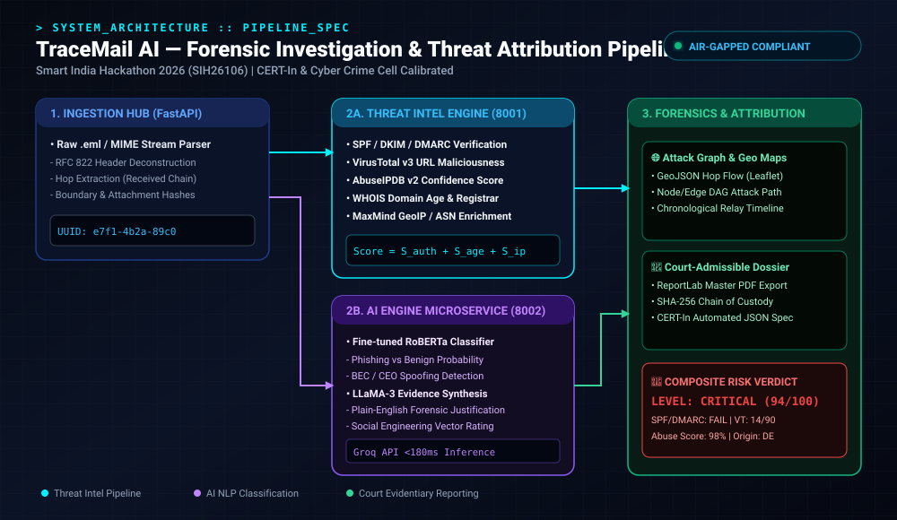
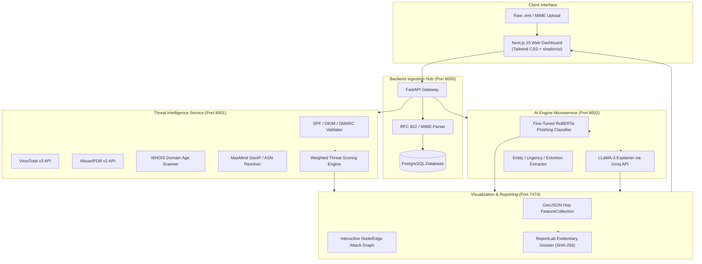

<div align="center">

# 🛡️ TraceMail AI — Automated Cyber Forensic Investigation & Threat Attribution Platform

**Smart India Hackathon 2026 (SIH26106) Flagship Solution**  
*Next-Generation Digital Forensics, Automated IOC Attribution, and RFC 822 Email Attack Path Reconstruction*

[](https://github.com/nleelaranga-ai/TraceMail-AI)
[](https://github.com/nleelaranga-ai/TraceMail-AI)
[](https://fastapi.tiangolo.com)
[](https://nextjs.org)
[](LICENSE)

<br />



</div>

---

## 📑 Executive Summary

Email remains the primary attack vector in **over 80% of sophisticated cyber breaches**, facilitating Business Email Compromise (BEC), CEO spoofing, ransomware distribution, and credential harvesting. Traditional Security Operations Center (SOC) triage relies on manual header inspection, disparate threat intelligence lookups, and fragmented tooling, creating an investigation backlog that allows threat actors to persist undetected.

**TraceMail AI** is an enterprise-grade digital forensics platform engineered for **CERT-In, State Cyber Crime Cells, and Enterprise SOC Teams**. It automates end-to-end email triage:
1. **RFC 822 / MIME Header Deconstruction**: Parses nested `Received` relay hops, extracting originating IPs, transit timestamps, and cryptographic headers.
2. **Cryptographic Authentication**: Evaluates SPF, DKIM, and DMARC alignment against declared senders to detect spoofed identities.
3. **Multi-Feed Threat Enrichment**: Queries VirusTotal v3, AbuseIPDB v2, WHOIS domain age, and MaxMind GeoIP with intelligent caching and heuristic fallbacks.
4. **AI NLP Behavioral Phishing Analysis**: Fine-tuned RoBERTa models classify phishing probability, while LLaMA-3 synthesizes court-admissible forensic justifications via Groq API (<180ms latency).
5. **Interactive Attack Path Reconstruction**: Maps IP telemetry into chronological timelines and interactive node/edge attack graphs.
6. **Evidentiary Dossier Generation**: Emits court-admissible PDF forensic reports stamped with SHA-256 integrity hashes.

---

## 🎯 Problem Statement

Under the **Smart India Hackathon 2026 (SIH26106)** challenge, law enforcement and national CERT bodies face:
* **Obfuscated Email Hops**: Adversaries route malicious traffic through multiple proxy relays, open relays, and bulletproof hosting providers.
* **Spoofed Header Exploitation**: Attackers exploit lax DMARC configurations to impersonate executive leadership and financial institutions.
* **Alert Fatigue & Slow Triage**: SOC analysts spend 25–45 minutes per incident manually correlating IP reputations and domain registration dates.
* **Lack of Admissible Chain-of-Custody**: Investigative reports often lack cryptographic integrity proofs required in legal proceedings.

---

## 🏛️ System Architecture

TraceMail AI is structured as a high-throughput, microservices-based architecture orchestrated via Docker Compose:



---

## 🧮 Algorithmic Formulation & Threat Scoring

The platform computes a normalized composite threat score $S_{\text{composite}} \in [0, 100]$ using a multi-factor risk weighting formula:

$$S_{\text{composite}} = \min\left(100, \; S_{\text{auth}} + S_{\text{age}} + S_{\text{ip}} + S_{\text{url}} + S_{\text{spoof}}\right)$$

Where:
* **Authentication Penalty ($S_{\text{auth}} \le 40$)**:
  $$S_{\text{auth}} = 15 \cdot \mathbb{I}(\text{SPF} = \text{FAIL}) + 10 \cdot \mathbb{I}(\text{DKIM} = \text{FAIL}) + 15 \cdot \mathbb{I}(\text{DMARC} = \text{FAIL})$$
* **Domain Age Risk ($S_{\text{age}} \le 25$)**:
  $$S_{\text{age}} = \begin{cases} 25 & \text{if } \text{Age} \le 14 \text{ days} \\ 15 & \text{if } 14 < \text{Age} \le 30 \text{ days} \\ 5 & \text{if } 30 < \text{Age} \le 90 \text{ days} \\ 0 & \text{otherwise} \end{cases}$$
* **IP Abuse Penalty ($S_{\text{ip}} \le 30$)**:
  $$S_{\text{ip}} = 0.30 \times \max_{h \in \text{Hops}}(\text{AbuseIPDB\_Score}(h))$$
* **URL Maliciousness ($S_{\text{url}} \le 35$)**:
  $$S_{\text{url}} = 25 \cdot \mathbb{I}(\text{VT Positives} > 0) + 10 \cdot \mathbb{I}(\text{VT Positives} \ge 5)$$
* **Sender Spoof Discrepancy ($S_{\text{spoof}} \le 15$)**:
  $$S_{\text{spoof}} = 15 \cdot \mathbb{I}(\text{Header\_From} \neq \text{Envelope\_From})$$

### Risk Stratification Table
| Score Range | Classification | Indicator Color | Recommended Action |
| :--- | :--- | :--- | :--- |
| **0 – 29** | `BENIGN / SAFE` | 🟢 Green | Routine delivery to recipient mailbox. |
| **30 – 69** | `SUSPICIOUS` | 🟡 Amber | Quarantine email; require secondary SOC analyst signoff. |
| **70 – 89** | `HIGH RISK` | 🔴 Red | Block message, revoke compromised session tokens, alert CERT-In. |
| **90 – 100** | `CRITICAL THREAT` | 🚨 Dark Red | Initiate immediate host containment; automated legal dossier compile. |

---

## 📂 Project Repository Structure

```
TraceMail-AI/
├── .github/
│   └── workflows/
│       ├── ci.yml                    # Automated linting, mypy, and pytest matrix
│       └── release.yml               # Production container image build & dispatch
├── ai-engine/                        # AI NLP Phishing & Explainability Microservice
│   ├── app/
│   │   ├── classifier.py             # RoBERTa inference pipeline
│   │   ├── explainer.py              # LLaMA-3 prompt orchestration via Groq
│   │   └── main.py                   # FastAPI service definition (Port 8002)
│   └── Dockerfile
├── backend/                          # Backend Ingestion Hub & Database Layer
│   ├── app/
│   │   ├── api/                      # REST routers (emails, investigations, reports)
│   │   ├── core/                     # Configuration, security, and logging
│   │   ├── models/                   # SQLAlchemy ORM models
│   │   ├── parser/                   # RFC 822 & MIME multipart extractors
│   │   └── main.py                   # FastAPI application entry (Port 8000)
│   └── Dockerfile
├── threat_intelligence/              # Threat Intelligence & IOC Enrichment Engine
│   ├── app/
│   │   ├── auth_verifier.py          # SPF / DKIM / DMARC verification
│   │   ├── ip_enrichment.py          # AbuseIPDB v2 & MaxMind GeoIP integration
│   │   ├── url_scanner.py            # VirusTotal v3 asynchronous scanner
│   │   ├── whois_lookup.py           # Domain age & registrar extraction
│   │   └── scoring.py                # Composite risk calculator
│   └── Dockerfile
├── maps_engine/                      # Visualization & Attack Graph Engine
│   ├── app/
│   │   ├── attack_graph.py           # NetworkX DAG hop generator
│   │   └── geojson_builder.py        # Leaflet-compatible GeoJSON stream
│   └── Dockerfile
├── reports/                          # Legal & Forensic Dossier Generator
│   ├── templates/forensic_spec.html  # ReportLab / WeasyPrint layout
│   └── dossier_compiler.py           # SHA-256 stamped evidentiary PDF generator
├── frontend/                         # Next.js 15 App Router Frontend
│   ├── src/
│   │   ├── app/                      # Page routes (dashboard, investigate, dossier)
│   │   ├── components/               # Cyber-dark themed UI components (shadcn)
│   │   └── lib/                      # API client and WebSocket handlers
│   └── package.json
├── docker-compose.yml                # Multi-service production orchestration
├── requirements.txt                  # Python dependencies
└── README.md
```

---

## ⚡ Quickstart & Installation

### Option 1: One-Click Docker Compose (Recommended)

```bash
# Clone the repository
git clone https://github.com/nleelaranga-ai/TraceMail-AI.git
cd TraceMail-AI

# Create your local environment configuration
cp .env.example .env
# Populate VIRUSTOTAL_API_KEY, ABUSEIPDB_API_KEY, and GROQ_API_KEY

# Spin up the complete microservice cluster
docker-compose up --build -d

# Verify all services are healthy
docker-compose ps
```

Access the interfaces:
* **Web Dashboard**: `http://localhost:3000`
* **Backend Hub Swagger**: `http://localhost:8000/docs`
* **Threat Intel OpenAPI**: `http://localhost:8001/docs`
* **AI Engine OpenAPI**: `http://localhost:8002/docs`

---

## 🔌 API Reference & Integration

### 1. Ingest Raw Email
```bash
curl -X POST "http://localhost:8000/api/v1/investigate/upload" \
  -H "Content-Type: multipart/form-data" \
  -F "file=@sample_phishing.eml"
```

**Response Schema (`200 OK`)**:
```json
{
  "investigation_id": "e7f14b2a-89c0-4821-bc6e-1d6f54c901e2",
  "sha256_hash": "a89b3f2e1c9d8e7a6b5c4d3e2f1a0b9c8d7e6f5a4b3c2d1e0f9a8b7c6d5e4f3a",
  "status": "COMPLETED",
  "processing_time_ms": 342,
  "summary": {
    "verdict": "CRITICAL_THREAT",
    "composite_risk_score": 94,
    "originating_ip": "185.220.101.4",
    "originating_country": "Germany",
    "spf_status": "FAIL",
    "dkim_status": "FAIL",
    "dmarc_status": "FAIL",
    "malicious_urls_detected": 1
  }
}
```

### 2. Retrieve Forensic Dossier (Court-Admissible PDF)
```bash
curl -X GET "http://localhost:8000/api/v1/investigate/e7f14b2a-89c0-4821-bc6e-1d6f54c901e2/dossier" \
  --output forensic_dossier_e7f14b2a.pdf
```

---

## 🗺️ Engineering Roadmap

- [x] **Milestone 1**: RFC 822 header deconstruction and SPF/DKIM/DMARC validation engine.
- [x] **Milestone 2**: Multi-source threat intelligence orchestration (VirusTotal, AbuseIPDB, WHOIS).
- [x] **Milestone 3**: Fine-tuned RoBERTa phishing classification and LLaMA-3 explainability via Groq.
- [x] **Milestone 4**: Automated PDF dossier compilation with SHA-256 integrity verification.
- [ ] **Milestone 5 (Q3 2026)**: MISP (Malware Information Sharing Platform) & STIX/TAXII automated threat feed publishing.
- [ ] **Milestone 6 (Q4 2026)**: Browser extension for real-time Chrome/Outlook webmail inspection.
- [ ] **Milestone 7 (2027)**: Graph neural network (GNN) model for multi-organization attack campaign attribution.

---

## 📜 License & Acknowledgments

Distributed under the **MIT License**. See `LICENSE` for details.

**Lead Architect & Developer**:  
**LEELA RANGA PRASAD** — *AI & Data Science Undergraduate, VR Siddhartha Engineering College*  
*Team Lead, Smart India Hackathon 2026 (SIH26106)*  
[LinkedIn](https://linkedin.com/in/leela-ranga-prasad-ba4936214) • [GitHub](https://github.com/nleelaranga-ai) • [Email](mailto:n.leelaranga@gmail.com)
