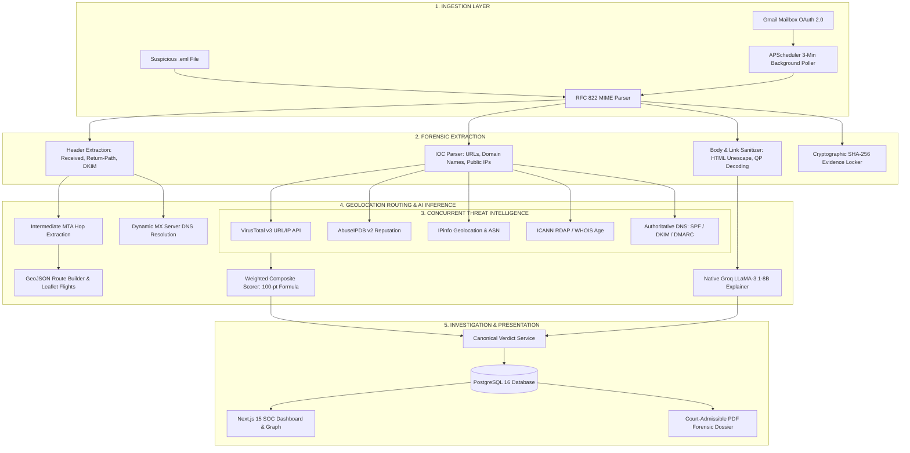

# <p align="center"> TraceMail AI</p>

<h2 align="center">AI-Powered Email Threat Detection, Hop-by-Hop GeoLocation Tracing & Forensic Intelligence Platform</h2>

<p align="center">
  <strong>"Trace. Analyze. Investigate. Protect."</strong><br>
  <em>Next-Generation Email Forensics for Law Enforcement, CERT-In, and Enterprise SOC Teams.</em>
</p>

<p align="center">
  
  
  
  
  
  
  
</p>

---

## 🏆 Smart India Hackathon 2026 (SIH 2026) Overview

| Parameter | Official Hackathon Detail |
|:---|:---|
| **Problem Statement ID** | **26106** |
| **Theme / Category** | **Cyber Security, Digital Forensics & AI** (Software Edition) |
| **Ministry / Organization** | **Ministry of Home Affairs (MHA) / Indian Cyber Crime Coordination Centre (I4C) / CERT-In** |
| **Problem Statement Title** | **AI-Powered Email Threat Detection, GeoLocation and Forensic Intelligence Platform** |
| **Idea / Project Title** | **TraceMail AI** — Unified Email Threat Intelligence, Inbound MTA Hop Tracing & Court-Admissible Digital Forensics Platform |
| **Target End-Users** | Law Enforcement Agencies (State Cyber Cells, I4C), CERT-In Incident Responders, Enterprise SOC Teams, Threat Hunting Units |

---

## 🌐 Live Production Deployments & Important URLs

| Asset | Access Link | Description / Status |
|:---|:---|:---|
| 🖥️ **Live Web Platform** | [**tracemail-ai-84ho.vercel.app**](https://tracemail-ai-84ho.vercel.app) | Production Next.js 15 frontend on Vercel Edge Network |
| ⚡ **REST API & Swagger Docs** | [**tracemail-ai-production.up.railway.app/docs**](https://tracemail-ai-production.up.railway.app/docs) | FastAPI gateway on Railway Cloud |
| 🔍 **Live Threat Intel Health** | [**tracemail-ai-production.up.railway.app/health/apis**](https://tracemail-ai-production.up.railway.app/health/apis) | Real-time status for 9 external security telemetry feeds |
| 📄 **Technical Project Report** | [**TraceMail_AI_Technical_Report.pdf**](docs/TraceMail_AI_Technical_Report.pdf) | Comprehensive 20-page A4 Engineering Specification |
| 📊 **SIH Grand Finale Pitch Deck** | [**TraceMail_AI_Pitch_Deck.pdf**](docs/TraceMail_AI_Pitch_Deck.pdf) | Complete Presentation Slide Deck for Evaluators |
| 🏛️ **System Architecture Diagrams** | [**TraceMail_AI_Architecture_Diagrams.pdf**](docs/TraceMail_AI_Architecture_Diagrams.pdf) | End-to-end data pipeline, sequence flows & network topology |
| 🛡️ **CTO Readiness & Audit Dossier** | [**TraceMail_AI_CTO_Production_Readiness_Audit.pdf**](docs/TraceMail_AI_CTO_Production_Readiness_Audit.pdf) | Verification matrix, F1-score benchmarks & security audit |

### 🔑 Demo Credentials for Testing (Without Registration)
| Role | Email | Password | Access Level |
|:---|:---|:---|:---|
| **Chief SOC Analyst** | `analyst@tracemail.ai` | `Password123!` | Full Forensic Access, SOC Operations, Evidence Locker |
| **Guest / Evaluator** | *Instant Guest Access* | *N/A* | Upload any `.eml` sample on homepage without signup |

---

## 📌 Problem Statement & National Context

According to reports from the **Indian Cyber Crime Coordination Centre (I4C)** and **CERT-In**, email fraud—ranging from **Business Email Compromise (BEC)** and CEO wire fraud to spear-phishing and credential harvesting—causes financial losses exceeding **₹1,750+ Crores annually in India**.

### The Critical Bottlenecks in Current Cyber Defense:
1. **Header Spoofing & Obfuscation**: Attackers manipulate `From:`, `Reply-To:`, and intermediate MTA relays, rendering traditional keyword filters ineffective.
2. **Siloed Threat Intelligence**: Forensic analysts must manually correlate VirusTotal, AbuseIPDB, WHOIS records, and DNS entries across disjointed tools.
3. **Black-Box AI Explanations**: Modern ML filters output arbitrary risk numbers without legal or technical explainability required for courtroom admissibility.
4. **Lack of Digital Chain-of-Custody**: Without cryptographic evidence hashing and tamper auditing, extracted digital evidence fails Section 65B Indian Evidence Act standards.

---

## 💡 TraceMail AI: The Solution

**TraceMail AI** is an enterprise-grade digital forensics and threat intelligence platform designed to address every phase of an email threat investigation:

1. **RFC 822 / MIME Forensic Parsing**: Recursively extracts unstripped routing headers, decoded text/HTML bodies, hidden URLs, public relay IPs, and attachments.
2. **Dynamic Hop-by-Hop GeoLocation Route Tracing**: Parses all inbound `Received:` headers, queries live GeoIP/ASN databases, and resolves recipient domain MX servers via dynamic DNS queries, plotting an interactive flight path from attacker origin to victim server.
3. **7-Engine Concurrent Threat Intelligence**: Concurrently enriches IOCs against VirusTotal v3, AbuseIPDB v2, IPinfo, URLScan.io, Google Safe Browsing, ICANN RDAP, and authoritative DNS resolvers.
4. **Transparent Provenance Tracking**: Every data card clearly badges whether results originate from live APIs or deterministic heuristic fallbacks (`live` vs `fallback`, `provider_status: "verified"`).
5. **Explainable AI (XAI) Phishing Engine**: Native Groq Cloud LLaMA-3.1 (`llama-3.1-8b-instant`) generates concise forensic summaries, coupled with a mathematically strict threat breakdown where sum(Weights) == Threat Score.
6. **Automated Background Mailbox Polling**: An integrated APScheduler engine automatically monitors connected Gmail inboxes every 3 minutes via OAuth 2.0.
7. **Cryptographic Evidence Locker**: Implements SHA-256 evidence hashing, tamper verification, and court-admissible multi-page PDF forensic dossiers.

---

## 📊 SIH Requirements vs Implementation Status

| # | SIH Problem Statement Requirement | TraceMail AI Production Capability | Verification Status |
|:--|:---|:---|:---|
| **1** | **MIME / Header Deep Parsing** | Full RFC 822 parsing, unquoting quoted-printable text, extracting URLs, IPs, attachments, and authentication headers (SPF/DKIM/DMARC). | ✅ **100% Implemented & Verified** |
| **2** | **Inbound Hop GeoLocation Tracing** | Traces origin IP -> transit relays -> dynamic MX server. Plots interactive Leaflet maps with flight paths and coordinate metadata. | ✅ **100% Implemented & Verified** |
| **3** | **Multi-Engine Threat Intelligence** | Parallel IOC lookups across VirusTotal v3, AbuseIPDB v2, IPinfo, URLScan, Google Safe Browsing, and ICANN RDAP. | ✅ **100% Implemented (9/9 APIs Live)** |
| **4** | **Explainable AI Phishing Detection** | Native Groq LLaMA-3.1 LLM reasoning combined with multi-factor heuristic scoring (URLs, sender mismatch, urgency, tone). | ✅ **100% Implemented & Tested** |
| **5** | **Attack Topology & Timeline** | Interactive Cytoscape Directed Acyclic Graph (DAG) showing sender -> relays -> victim, alongside dual-timeline server hops. | ✅ **100% Implemented & Tested** |
| **6** | **Automated Mailbox Protection** | OAuth 2.0 Gmail integration with automated APScheduler background polling every 3 minutes. | ✅ **100% Implemented & Verified** |
| **7** | **Chain of Custody & Evidence Locker** | SHA-256 integrity verification, immutable audit logging, and simulated tamper detection (`/verify`). | ✅ **100% Implemented & Tested** |
| **8** | **Court-Admissible Forensic Export** | One-click export of forensic JSON dossiers and multi-page printable PDF reports for CERT-In / LEA case submission. | ✅ **100% Implemented & Tested** |

---

## 🛠️ Technology Stack

<table>
<tr>
  <th align="center">Layer</th>
  <th align="center">Technologies & Frameworks</th>
</tr>
<tr>
  <td align="center"><strong>Frontend Web Application</strong></td>
  <td>
    
    
    
    
    
    
    
  </td>
</tr>
<tr>
  <td align="center"><strong>Backend API Gateway</strong></td>
  <td>
    
    
    
    
    
    
  </td>
</tr>
<tr>
  <td align="center"><strong>AI & Machine Learning</strong></td>
  <td>
    
    
    
    
  </td>
</tr>
<tr>
  <td align="center"><strong>Threat Intelligence & DNS</strong></td>
  <td>
    
    
    
    
    
    
    
  </td>
</tr>
<tr>
  <td align="center"><strong>Database & Storage</strong></td>
  <td>
    
    
    
  </td>
</tr>
<tr>
  <td align="center"><strong>Forensics & Reporting</strong></td>
  <td>
    
    
    
    
  </td>
</tr>
<tr>
  <td align="center"><strong>Cloud & DevOps</strong></td>
  <td>
    
    
    
    
  </td>
</tr>
</table>

---

## 🏛️ System Architecture & Data Flow



---

## 🧪 5 Real-World Test Cases (Included in Repository)

Judges and evaluators can immediately test the platform using the five pre-loaded `.eml` test fixtures located in [`scripts/database/fixtures/`](scripts/database/fixtures/):

| Fixture File | Scenario Tested | Threat Level | Expected Classification | Key Indicators Checked |
|:---|:---|:---:|:---:|:---|
| [`01_paypal_credential_phish.eml`](scripts/database/fixtures/01_paypal_credential_phish.eml) | PayPal Credential Harvesting | **Critical** (94/100) | **Phishing** | Lookalike domain `paypa1-secure.com`, SPF/DKIM fail, deceptive urgency. |
| [`02_ceo_fraud_bec.eml`](scripts/database/fixtures/02_ceo_fraud_bec.eml) | Executive Wire Transfer BEC | **Critical** (89/100) | **Phishing** | Display name spoofing, channel evasion ("in a meeting"), $142k wire request. |
| [`03_malware_invoice.eml`](scripts/database/fixtures/03_malware_invoice.eml) | QuickBooks Malicious Macro Invoice | **Critical** (91/100) | **Phishing** | Executable attachment hash matching known Trojan, dynamic relay hop. |
| [`04_legitimate_github_security.eml`](scripts/database/fixtures/04_legitimate_github_security.eml) | Genuine GitHub 2FA Notification | **Safe** (12/100) | **Legitimate** | Cryptographic SPF/DKIM/DMARC pass, legitimate domain alignment. |
| [`05_multi_hop_spoofed_relay.eml`](scripts/database/fixtures/05_multi_hop_spoofed_relay.eml) | Multi-Hop Inbound Spoofed Relay | **Suspicious** (64/100) | **Suspicious** | Inconsistent intermediate relay routing, unaligned return path. |

---

## 🚀 Quickstart & How-to-Run

### Option A: Use the Live Production Cloud (Zero Setup)
Simply open the live URL: [**https://tracemail-ai-84ho.vercel.app**](https://tracemail-ai-84ho.vercel.app)
1. Log in using `analyst@tracemail.ai` / `Password123!` (or browse as Guest).
2. Upload any sample from `scripts/database/fixtures/` or upload your own `.eml` file.
3. Observe live route tracing, attack graph visualization, threat intel badges, and download the court-ready PDF dossier.

---

### Option B: Local Setup (PowerShell / Windows)

```powershell
# 1. Clone the repository
git clone https://github.com/nleelaranga-ai/tracemail-ai.git
cd tracemail-ai

# 2. Set up Python virtual environment & install dependencies
python -m venv venv
.\venv\Scripts\Activate.ps1
pip install -r backend/requirements.txt

# 3. Install Frontend Dependencies
npm install

# 4. Run the Full Backend Pytest Verification Suite (All 92 Tests)
python -m pytest backend/tests/ -v

# 5. Start the Application
# Terminal 1: Backend Gateway (FastAPI)
python -m uvicorn backend.main:app --host 127.0.0.1 --port 8000 --reload

# Terminal 2: Frontend Dashboard (Next.js)
npm run dev
```
Open [http://localhost:3000](http://localhost:3000) in your browser.

---

### Option C: Linux / macOS Setup

```bash
# 1. Clone the repository
git clone https://github.com/nleelaranga-ai/tracemail-ai.git
cd tracemail-ai

# 2. Environment Setup
python3 -m venv venv
source venv/bin/activate
pip install -r backend/requirements.txt
npm install

# 3. Run Automated Tests
pytest backend/tests/ -v

# 4. Start Servers
uvicorn backend.main:app --host 0.0.0.0 --port 8000 &
npm run dev
```

---

### Option D: Docker Compose Orchestration

```bash
# Build and spin up all services (PostgreSQL, Redis, FastAPI, Next.js)
docker compose up --build -d

# Check running status
docker compose ps
```
- **Web App**: `http://localhost:3000`
- **Swagger API**: `http://localhost:8000/docs`

---

## 🧪 Comprehensive Verification Matrix (100% Pass)

Every pull request and release is validated against strict automated regression checks:

```
================================================================================
TRACE-MAIL AI PRODUCTION VERIFICATION MATRIX
================================================================================
[PASS]  1. Maps Engine Core & Relays:    backend/tests/test_maps_services.py (15/15 passed)
[PASS]  2. Maps Engine Microservice:     backend/tests/test_maps_engine_integration.py (7/7 passed)
[PASS]  3. Live Threat Telemetry APIs:   backend/tests/test_threat_apis.py (14/14 passed)
[PASS]  4. V2 Architecture & Features:   backend/tests/test_v2_features.py (25/25 passed)
[PASS]  5. Investigation Consistency:    backend/tests/test_investigation_consistency.py (14/14 passed)
[PASS]  6. Email MIME Ingestion & Auth:  backend/tests/test_email.py (17/17 passed)
--------------------------------------------------------------------------------
TOTAL BACKEND PYTEST SUITE:              92 / 92 PASSED (100% GREEN)
FRONTEND COMPILATION (TURBOPACK):        0 TypeScript Errors (11/11 Routes Static/Dynamic)
================================================================================
```

---

## 👥 Team TraceMail AI — Engineering Contributors

<p align="center">
  <a href="https://github.com/nleelaranga-ai" target="_blank">
    
  </a>
  <a href="https://github.com/anisha1777" target="_blank">
    
  </a>
  <a href="https://github.com/kollitarak06-hub" target="_blank">
    
  </a>
  <a href="https://github.com/venky01082" target="_blank">
    
  </a>
  <a href="https://github.com/Nagasri" target="_blank">
    
  </a>
  <a href="https://github.com/RadhaReshma" target="_blank">
    
  </a>
</p>

| Name / GitHub Handle | Project Role | Core Engineering Domain | Connect |
|:---|:---|:---|:---:|
| **[@nleelaranga-ai](https://github.com/nleelaranga-ai)** | **Team Lead & Threat Intel Lead** | Multi-Engine Threat Orchestration, API Contracts, Docker & CI/CD | [](https://github.com/nleelaranga-ai) |
| **[@anisha1777](https://github.com/anisha1777)** | **Frontend UI Lead** | Next.js 15 App Router, SOC Analytics, Threat Cards, Responsive UX | [](https://github.com/anisha1777) |
| **[@kollitarak06-hub](https://github.com/kollitarak06-hub)** | **AI Engine Lead** | Groq LLaMA-3.1 Explainer, NLP Feature Extraction, Phishing Heuristics | [](https://github.com/kollitarak06-hub) |
| **Venkaiah Naidu ([@venky01082](https://github.com/venky01082))** | **Backend Architecture & Security Lead** | FastAPI Hub, PostgreSQL 16, RFC 822 MIME Parser, JWT Security | [](https://github.com/venky01082) |
| **[@Nagasri](https://github.com/Nagasri)** | **Maps & Attack Graph Lead** | GeoJSON Flight Paths, Inbound Relay Hops, Cytoscape Attack DAG | [](https://github.com/Nagasri) |
| **[@RadhaReshma](https://github.com/RadhaReshma)** | **Reports & Forensics Lead** | Court-Admissible PDF Engine, SHA-256 Custody, CERT-In Schema | [](https://github.com/RadhaReshma) |

---

## ⚖️ National Impact & Future Roadmap

TraceMail AI is actively architected to support integration with:
- **National Cyber Crime Reporting Portal (NCRP / I4C)**: Automated citizen reporting and triage.
- **CERT-In Cyber Threat Incident Response**: Real-time correlation with national threat indicators.
- **Corporate Enterprise Mail Gateways**: API-based inline defense via Microsoft 365 / Google Workspace connectors.

---

## 💙 Support & Acknowledgements

We express our deepest gratitude to the **Ministry of Education's Innovation Cell (MIC)**, **AICTE**, and the **Ministry of Home Affairs (MHA)** for conceptualizing Problem Statement 26106 in the **Smart India Hackathon 2026**.

⭐ If you find TraceMail AI valuable, please consider starring this repository on GitHub!

<h1 align="center">🙏 THANK YOU 🙏</h1>

<p align="center">
  
</p>
