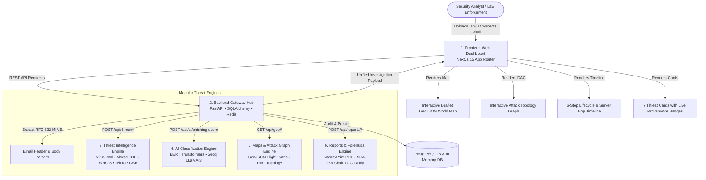

# 🛡️ TraceMail AI

<p align="center">
  
  
  
  
  
  
  
</p>

<p align="center">
  <strong>"Trace. Analyze. Investigate. Protect."</strong><br>
  <em>AI-Powered Email Threat Intelligence & Digital Forensics Platform for Phishing Detection, Identity Spoofing Analysis, and Header Tracing.</em>
</p>

<p align="center">
  🌐 <strong>Live Production Frontend:</strong> <a href="https://tracemail-ai-84ho.vercel.app" target="_blank">https://tracemail-ai-84ho.vercel.app</a><br>
  ⚡ <strong>Live Production Backend API:</strong> <a href="https://tracemail-ai-production.up.railway.app" target="_blank">https://tracemail-ai-production.up.railway.app</a><br>
  🔍 <strong>Live Threat Intelligence Health:</strong> <a href="https://tracemail-ai-production.up.railway.app/health/apis" target="_blank">https://tracemail-ai-production.up.railway.app/health/apis</a>
</p>

---

## 🎯 Executive Overview

**TraceMail AI** is an enterprise-grade cybersecurity and digital forensics platform engineered for **CERT-In, Cyber Police / State Cyber Cells, Security Operations Centers (SOC), and incident response teams**. 

Built for **Smart India Hackathon 2026 (Problem Statement 26106)**, TraceMail AI solves the critical challenge of email fraud, Business Email Compromise (BEC), spear-phishing, and credential harvesting. It ingests suspicious emails (`.eml` or raw RFC 822 headers), traces the transmission route across mail transfer agents (MTAs), validates domain identities, performs multi-engine threat intelligence lookups with live provenance, executes AI-driven explainability scoring, renders interactive attack topologies, and exports court-admissible forensic dossiers.

---

## 🏛️ Six-Piece Modular Architecture (Puzzle Edition)

TraceMail AI is structured around a decoupled, contract-driven architecture where each engineering domain functions both as an in-process engine and a deployable microservice:



---

## ✨ Key Platform Capabilities

| Feature | Description | Technical Implementation |
|---|---|---|
| 🛰️ **Hop-by-Hop Route Tracing** | Traces inbound relay hops from origin MTA to recipient mailbox with coordinates. | GeoIP resolution, Haversine flight paths, GeoJSON FeatureCollections rendered in Leaflet. |
| 🕸️ **Interactive Attack Topology** | Directed Acyclic Graph (DAG) showing sender, relay nodes, host ASNs, and victim. | Cytoscape / SVG graph with interactive WHOIS, ASN reputation, and route telemetry modal. |
| 🛡️ **7-Engine Threat Intelligence** | Concurrent queries across global threat feeds with strict timeout guards. | VirusTotal v3, AbuseIPDB v2, IPinfo, URLScan.io, Google Safe Browsing, ICANN RDAP, DNS. |
| 🏷️ **Truthful Provenance Tracking** | Clear badges indicating whether data came from live APIs or heuristic fallbacks. | Dual-mode tracking (`source`, `mode`, `provider_status`, `fallback_used`) per threat card. |
| 🤖 **Explainable AI Phishing** | Mathematical and NLP breakdown explaining *why* an email is malicious. | Weighted composite scoring (VT, SPF, DKIM, AbuseIPDB, Domain Age) + LLaMA-3 explainability. |
| ⏱️ **Dual Timeline System** | Switches between the 6-Step Forensic Lifecycle and Mail Server Hop Progression. | Interactive tabbed panel with completion status, ISO timestamps, and flagged relays. |
| 🔐 **Forensic Chain of Custody** | Evidence Locker with SHA-256 cryptographic hashing and tamper verification. | SHA-256 digest calculation, tamper simulation (`/verify`), and immutable audit logs. |
| 📄 **Court-Admissible Reports** | One-click forensic reporting for law enforcement and CERT-In compliance. | Dual-format export: Machine-readable JSON + High-fidelity multi-page PDF forensic dossier. |
| 📊 **Enterprise SOC Center** | Global threat feed, organizational risk heatmap, and targeted department metrics. | Real-time analytics, risk breakdown (Critical, High, Medium, Low), and campaign monitoring. |

---

## 👥 Project Team & Contributors

<p align="center">
  <a href="https://github.com/nleelaranga-ai" target="_blank">
    
  </a>
  <a href="https://github.com/anisha1777" target="_blank">
    
  </a>
  <a href="https://github.com/kollitarak06-hub" target="_blank">
    
  </a>
  <a href="https://github.com/Nagasri" target="_blank">
    
  </a>
  <a href="https://github.com/RadhaReshma" target="_blank">
    
  </a>
  <a href="https://github.com/venky01082" target="_blank">
    
  </a>
</p>

> Detailed individual responsibility profiles and commit guidelines: [**docs/CONTRIBUTORS.md**](docs/CONTRIBUTORS.md).

| # | Role / Module | Module Lead | Primary Folder | Key Technologies |
|---|---|---|---|---|
| 1 | **Threat Intelligence & Integration Lead** | **[@nleelaranga-ai](https://github.com/nleelaranga-ai)** | `threat_intelligence/`, `shared/` | VirusTotal v3, AbuseIPDB, IPinfo, GSB, dnspython, Docker |
| 2 | **Frontend UI Lead** | **[@anisha1777](https://github.com/anisha1777)** | `frontend/`, `components/` | Next.js 15, React 19, Tailwind CSS, shadcn/ui, TanStack Query |
| 3 | **AI Engine Lead** | **[@kollitarak06-hub](https://github.com/kollitarak06-hub)** | `ai-engine/` | Hugging Face Transformers, PyTorch, Groq LLaMA-3 |
| 4 | **Maps & Attack Graph Lead** | **[@Nagasri](https://github.com/Nagasri)** | `maps_engine/`, `maps-engine/` | GeoJSON Hop Tracing, Flight Paths, DAG Topology, Port 8003 Microservice |
| 5 | **Reports & Forensics Lead** | **[@RadhaReshma](https://github.com/RadhaReshma)** | `team_reports/`, `reports/` | WeasyPrint, ReportLab, Jinja2, Cryptography, SHA-256 Custody |
| 6 | **Backend Architecture & Security Lead** | **Venkaiah Naidu Pallapolu ([@venky01082](https://github.com/venky01082))** | `backend/` | FastAPI, PostgreSQL 16, SQLAlchemy, Redis, JWT Auth |

---

## 🔒 Master API Contracts (Section 6 Compliance)

All inter-module communication is locked to strict Section 6 JSON contracts:

### 1. IP Threat Enrichment (`GET /api/threat/ip/{ip}`)
```json
{
  "ip": "185.220.101.4",
  "country": "Germany",
  "city": "Frankfurt",
  "lat": 50.1109,
  "lon": 8.6821,
  "isp": "M247 Ltd",
  "asn": "AS9009",
  "abuseScore": 92,
  "malicious": true
}
```

### 2. URL Reputation Analysis (`POST /api/threat/url`)
```json
{
  "url": "http://paypa1-secure.com/login",
  "malicious": true,
  "category": "phishing",
  "scanDate": "2026-09-06T10:00:00Z",
  "vtPositives": 14,
  "vtTotal": 90
}
```

### 3. Email Authentication & Domain Age (`POST /api/threat/auth-check`)
```json
{
  "spf": "fail",
  "dkim": "fail",
  "dmarc": "fail",
  "domainAge": "14 days",
  "registrar": "NameCheap Inc."
}
```

### 4. Composite Threat Intelligence (`POST /api/threat/composite-intel`)
```json
{
  "risk_level": "CRITICAL",
  "risk_score": 89,
  "malicious_url": true,
  "domain_age_days": 18,
  "ip_reputation": 92,
  "country": "Germany",
  "city": "Frankfurt",
  "spf": "FAIL",
  "dkim": "FAIL",
  "dmarc": "FAIL"
}
```

---

## 🧪 Comprehensive Verification Matrix (100% Green)

```bash
# 1. Maps Engine Standalone Suite (4/4 tests)
python maps-engine/test_maps_engine.py                  -> 100% Pass (GeoJSON, Timeline, Graph)

# 2. Maps Engine Integration Suite (7/7 tests)
pytest backend/tests/test_maps_engine_integration.py -v -> 7 passed (1.05s)

# 3. Threat Intelligence Provider Matrix (14/14 tests)
pytest backend/tests/test_threat_apis.py -v             -> 14 passed (1.03s)

# 4. Full Backend & API Test Suite (48/48 tests)
pytest backend/tests/ -q                                -> 48 passed (22.75s)

# 5. Forensics & PDF Report Engine (146/146 tests)
pytest team_reports/ -q                                 -> 146 passed (2.67s)

# 6. Production Next.js Compilation (Dual-Tree Parity)
npm run build (Root)                                    -> Compiled in 5.2s (11 routes)
npm run build (frontend/)                               -> Compiled in 2.7s (11 routes)
```

---

## ⚡ Quickstart & Installation

### Option 1: Automated Local Setup (PowerShell / Windows)
```powershell
# 1. Clone the repository
git clone https://github.com/nleelaranga-ai/tracemail-ai.git
cd tracemail-ai

# 2. Run automated environment setup (creates venv & installs dependencies)
.\scripts\setup\setup.ps1

# 3. Seed realistic phishing test cases
python .\scripts\database\seed_database.py

# 4. Run the full verification test suite
pytest backend/tests/ -v

# 5. Launch backend & frontend
.\start.sh
```

### Option 2: Linux / macOS
```bash
chmod +x scripts/**/*.sh start.sh
./scripts/setup/setup.sh
python3 scripts/database/seed_database.py
pytest backend/tests/ -v
./start.sh
```

### Option 3: Full-Stack Docker Compose Orchestration
```bash
# Boot the entire stack (PostgreSQL, Threat Intel, Maps, Backend, AI, Frontend)
docker compose up --build -d

# Verify all containers are operational
docker compose ps
```
- **Web Dashboard**: [http://localhost:3000](http://localhost:3000)
- **FastAPI Hub & Swagger**: [http://localhost:8000/docs](http://localhost:8000/docs)
- **Threat Intelligence Engine**: [http://localhost:8002/docs](http://localhost:8002/docs)
- **Maps Engine Microservice**: [http://localhost:8003/health](http://localhost:8003/health)

---

## 📚 Project Documentation Hub

- 👥 [**Team Contributors & Responsibilities**](docs/CONTRIBUTORS.md)
- 🏛️ [**Master Architecture & Contracts**](ARCHITECTURE.md)
- 📊 [**Production Status & SIH 26106 Audit Report**](STATUS_REPORT.md)
- 📡 [**REST API Specification**](docs/API.md)
- 🛠️ [**Setup & Installation Guide**](docs/SETUP.md)
- 🔀 [**Git Branching & Development Workflow**](docs/WORKFLOW.md)
- 🛡️ [**Security Architecture & Standards**](docs/SECURITY.md)

---

## 📜 License

This project is licensed under the **MIT License** — see the [LICENSE](LICENSE) file for details. Built with pride by Team TraceMail AI for **Smart India Hackathon 2026**.
