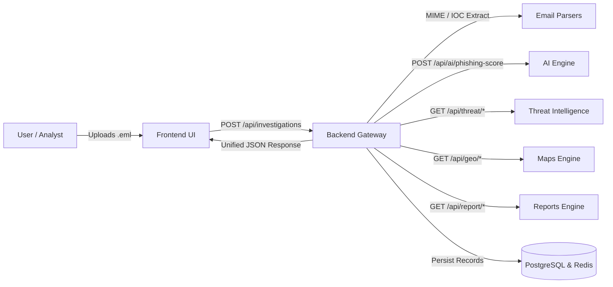

# 👥 TraceMail AI Contributors

> Meet the engineering team building **TraceMail AI** — an AI-Powered Email Threat Intelligence & Forensic Investigation Platform for Smart India Hackathon 2026 (SIH26106).

---

## 🏛️ Project Team & Active Contributors

  
  
  
  
  
  

---

## 📋 Module Ownership Cards

<table>
<tr>

<td align="center" width="33%">

### Threat Intelligence & Integration Lead
**[@nleelaranga-ai](https://github.com/nleelaranga-ai)**

VirusTotal v3 • AbuseIPDB • WHOIS • Architecture • Integration

</td>

<td align="center" width="33%">

### Frontend UI Lead
**[@anisha1777](https://github.com/anisha1777)**

Next.js 15 • Tailwind CSS • Dashboard UI • Upload Flows

</td>

<td align="center" width="33%">

### AI Engine Lead
**[@kollitarak06-hub](https://github.com/kollitarak06-hub)**

Machine Learning • Phishing Classifiers • NLP Explanations

</td>

</tr>

<tr>

<td align="center" width="33%">

### Backend Architecture & Security Lead
**Venkaiah Naidu Pallapolu ([@venky01082](https://github.com/venky01082))**

FastAPI • PostgreSQL 16 • SQLAlchemy • Redis • JWT Auth • MIME Parsing

</td>

<td align="center" width="33%">

### Maps & Attack Graph Lead
**[@Nagasri](https://github.com/Nagasri)**

GeoJSON Hop Tracing • Server Timeline • Attack Topology • Maps Engine Core

</td>

<td align="center" width="33%">

### Reports & Forensics Lead
**[@RadhaReshma](https://github.com/RadhaReshma)**

PDF/JSON Forensic Reports • CERT-In Schema • Automated Testing

</td>

</tr>
</table>

---

## 📊 Responsibilities Matrix

| Contributor / Team | Primary Responsibilities | Key Technologies |
|:---|:---|:---|
| **[@nleelaranga-ai](https://github.com/nleelaranga-ai)** | Threat Intelligence Engine, IOC Enrichment, Master API Contracts, Docker Infrastructure | Python 3.12, VirusTotal, AbuseIPDB, dnspython, Docker |
| **[@anisha1777](https://github.com/anisha1777)** | Next.js 15 Web Dashboard, Email Upload interface, Verdict badges, UI/UX | Next.js 15, Tailwind CSS, TypeScript, TanStack Query |
| **[@kollitarak06-hub](https://github.com/kollitarak06-hub)** | Machine Learning phishing model, NLP feature extraction, explanation engine | Transformers, Scikit-learn, PyTorch, Groq LLaMA 3 |
| **Venkaiah Naidu Pallapolu ([@venky01082](https://github.com/venky01082))** | Central REST API gateway, JWT auth, PostgreSQL/Redis, MIME parsing, downstream orchestration | FastAPI, PostgreSQL 16, SQLAlchemy, Redis, Docker |
| **[@Nagasri](https://github.com/Nagasri)** | Maps Engine core architecture, GeoJSON relay paths, chronological hop timeline, attack topology | Python 3.12, GeoJSON, Leaflet / NetworkX, FastAPI |
| **[@RadhaReshma](https://github.com/RadhaReshma)** | Forensic PDF/JSON reports, legal evidence custody, CERT-In compliance schema | ReportLab, Jinja2, Pytest, Cryptography |

---

## 🔄 Inter-Module Collaboration Workflow

---

## 💡 How GitHub Populates the "Contributors" Sidebar

GitHub automatically generates the **Contributors** sidebar widget on the repository homepage:
1. Each teammate authors commits using the email address linked to their GitHub account (`git config user.email`).
2. Their feature branch is merged via a **Pull Request into `develop` / `main`**.
3. Once merged into the default branch, GitHub's analytics engine immediately places their circular avatar into the official **Contributors** sidebar.
