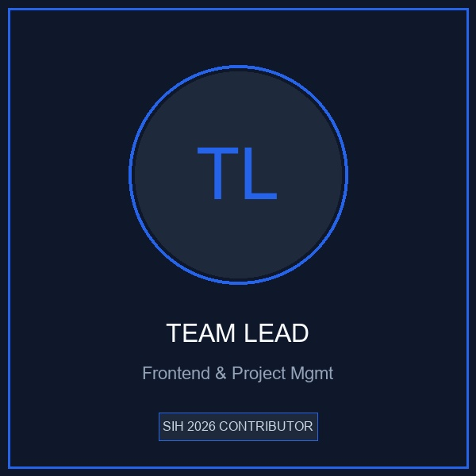
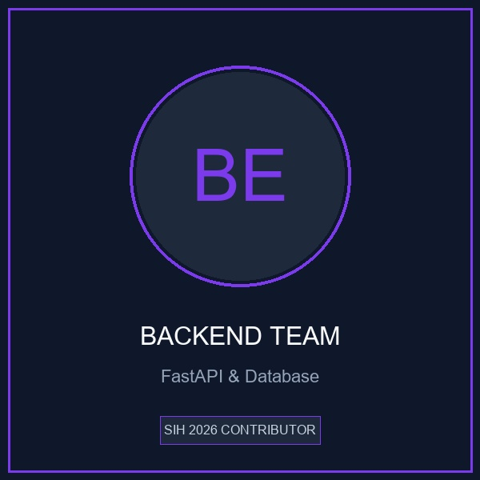
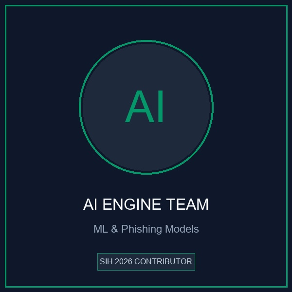
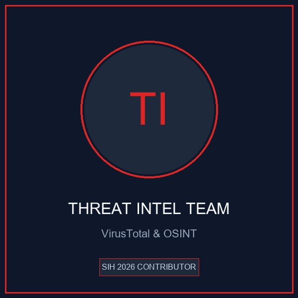
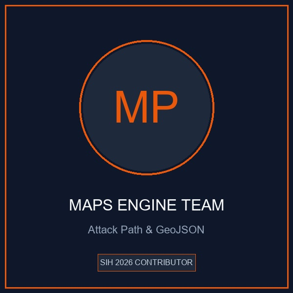
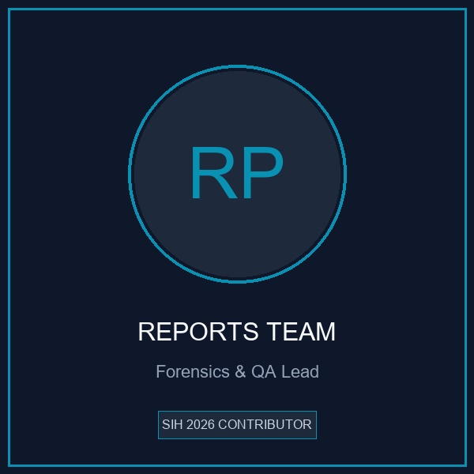
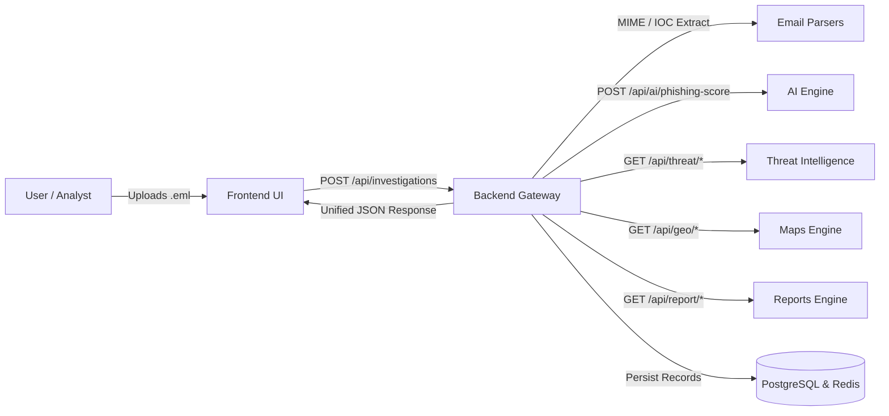

# 👥 TraceMail AI Contributors

> Meet the engineering team building **TraceMail AI** — an AI-Powered Email Threat Intelligence & Forensic Investigation Platform for Smart India Hackathon 2026 (SIH26106).

---

## 🏛️ Project Team

<table>
<tr>

<td align="center" width="33%">

### Team Lead

**Frontend & Project Management**

UI/UX • Next.js 15 • GitHub Management • Integration Coordination

</td>

<td align="center" width="33%">

### Backend Team

**FastAPI • PostgreSQL • Redis**

REST APIs • Authentication • Database • Microservice Orchestration

</td>

<td align="center" width="33%">

### AI Engine Team

**Machine Learning & NLP**

Phishing Classification • Transformers • LLM Forensic Explanations

</td>

</tr>

<tr>

<td align="center" width="33%">

### Threat Intelligence Team

**Cyber Threat Intelligence & OSINT**

VirusTotal v3 • WHOIS • AbuseIPDB • DNS Auth (SPF/DKIM/DMARC)

</td>

<td align="center" width="33%">

### Maps & Graph Team

**Attack Path Visualization**

GeoJSON Paths • Server Hop Timeline • Attack Graph Topology

</td>

<td align="center" width="33%">

### Reports & Forensics Team

**Digital Forensics & QA**

PDF/JSON Forensic Reports • CERT-In Schema • CI/CD & Testing

</td>

</tr>
</table>

---

## 📋 Responsibilities Matrix

| Team Module | Primary Responsibilities | Key Technologies |
|:---|:---|:---|
| **🎨 Frontend Team** | User dashboard, upload interface, authentication UI, responsive visualizations | Next.js 15, React, Tailwind CSS, TypeScript |
| **⚙️ Backend Team** | Central REST API gateway, JWT auth, PostgreSQL/Redis, MIME parsing, downstream orchestration | FastAPI, PostgreSQL 16, SQLAlchemy, Redis, Docker |
| **🤖 AI Engine Team** | Email phishing classification, NLP feature extraction, natural language explanations | Transformers, PyTorch, Groq / Llama 3, Scikit-learn |
| **🛡️ Threat Intelligence Team** | IOC extraction, multi-provider reputation scoring (VT, AbuseIPDB, WHOIS, DNS) | Python, dnspython, python-whois, REST clients |
| **🌍 Maps & Graph Team** | Mail server relay path tracing, GeoJSON generation, attack graph node/edge topology | GeoJSON, NetworkX, Leaflet / D3.js data structures |
| **📄 Reports & Forensics Team** | Executive and technical PDF report generation, machine-readable JSON exports, CI/CD pipelines | ReportLab, Jinja2, Pytest, GitHub Actions |

---

## 🔄 Inter-Module Collaboration Workflow

Every module communicates strictly through the **Master API Contracts** defined in [`ARCHITECTURE.md`](../ARCHITECTURE.md).

---

## 🤝 Code of Collaboration

1. **Role Ownership**: Every team member strictly owns their respective directory module. Cross-module alterations require formal Pull Request reviews.
2. **Contract Stability**: The JSON schemas defined in Section 6 of the architecture cannot be modified without team consensus.
3. **Continuous Integration**: Every feature branch must pass GitHub Actions testing before merging into `develop`.
