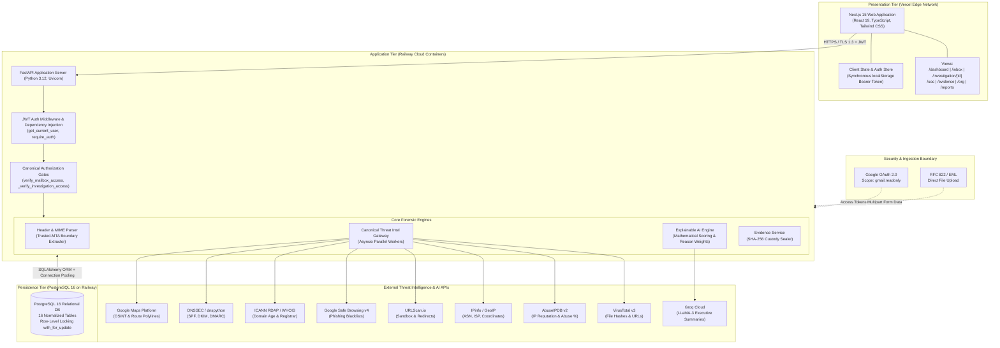
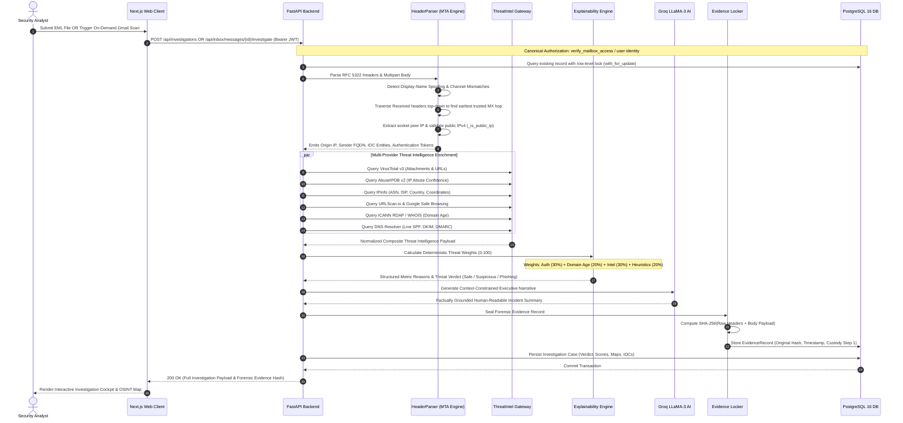
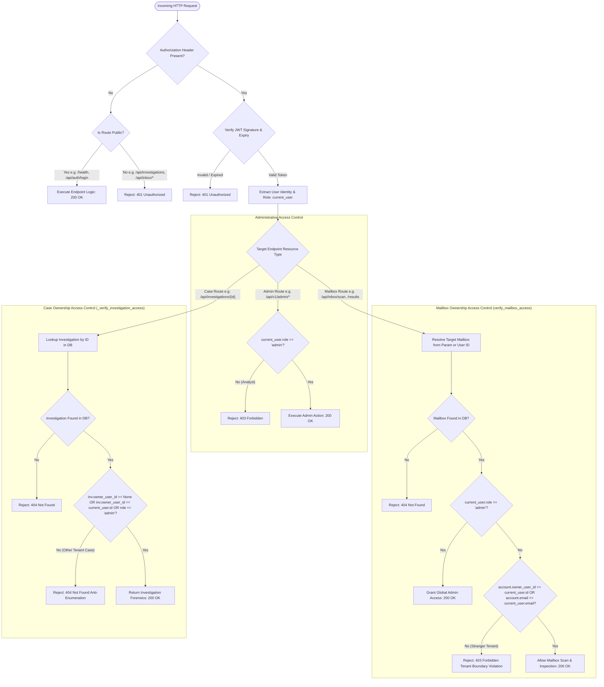

# TraceMail AI — Comprehensive Architecture Diagrams

This document contains the complete technical architecture diagrams for **TraceMail AI**, directly reflecting the production code, database schema, threat intelligence integration, and authentication workflows.

---

## 1. High-Level System Architecture



---

## 2. Investigation Pipeline / Sequence Diagram



---

## 3. Database Entity Relationship (ER) Diagram (Actual 16 Tables)

```mermaid
erDiagram
    users ||--o{ investigations : "owns (owner_user_id)"
    users ||--o{ gmail_accounts : "links (owner_user_id)"
    users ||--o{ audit_logs : "triggers (user_id)"
    investigations ||--o{ emails : "contains"
    investigations ||--o{ headers : "decomposes into"
    investigations ||--o{ ioc_entities : "extracts"
    investigations ||--o{ threat_results : "enriches with"
    investigations ||--o{ ai_results : "synthesizes"
    investigations ||--o{ evidence_records : "cryptographically seals"
    investigations ||--o{ attachment_scans : "inspects"
    investigations ||--o{ reports : "generates"
    investigations ||--o| investigation_geo_cache : "caches geodata"
    gmail_accounts ||--o{ inbox_scan_results : "monitors (account_email)"

    users {
        string id PK "usr_uuid"
        string email UK
        string password_hash
        string name
        string role "admin / analyst"
        boolean is_active
        datetime created_at
    }

    investigations {
        string id PK "inv_uuid"
        string status "processing / complete / failed"
        string sender
        string recipient
        string subject
        datetime received_at
        string domain
        string ip "Origin Public IP"
        string country
        string city
        json latitude
        json longitude
        integer phishing_score "0 to 100"
        string verdict "safe / suspicious / phishing"
        string risk_level "Low / Medium / High / Critical"
        text explanation
        text ai_summary
        text raw_headers
        text body_text
        json entities
        json auth_results
        json hop_timeline
        json timeline
        json geojson_map
        json attack_graph
        json threat_results
        json virus_total
        json abuse_ipdb
        json whois
        json dns
        json urlscan
        json google_safe_browsing
        json ai_analysis
        json ioc
        string evidence_hash "SHA-256"
        json action_items
        string owner_user_id FK "Indexed Tenant Boundary"
        datetime created_at
        datetime updated_at
    }

    gmail_accounts {
        string id PK "gacc_uuid"
        string email UK
        string owner_user_id FK "Indexed Tenant Boundary"
        text access_token
        text refresh_token
        datetime token_expiry
        boolean connected
        datetime created_at
        datetime last_scanned_at
    }

    inbox_scan_results {
        string id PK "inb_uuid"
        string account_email FK
        string message_id
        string sender
        string subject
        text snippet
        string risk "Safe / Suspicious / Critical"
        integer threat_score
        string verdict
        datetime scanned_at
        string investigation_id FK
    }

    evidence_records {
        string id PK "evd_uuid"
        string investigation_id FK
        string sha256 "Current Hash"
        string original_hash "Immutable Ingestion Seal"
        string investigator
        string status "Verified / Tampered / Exported"
        text raw_content
        datetime created_at
        datetime verified_at
        text custody_notes
    }

    attachment_scans {
        string id PK "att_uuid"
        string investigation_id FK
        string filename
        string file_type
        string sha256
        integer size_bytes
        boolean malicious
        string verdict
        string engine
        json details
        datetime created_at
    }

    emails {
        string id PK "eml_uuid"
        string investigation_id FK
        string raw_eml
        text parsed_body
        datetime ingested_at
    }

    headers {
        string id PK "hdr_uuid"
        string investigation_id FK
        string header_key
        text header_value
    }

    ioc_entities {
        string id PK "ioc_uuid"
        string investigation_id FK
        string entity_type "ip / domain / url / hash"
        string entity_value
        string reputation
    }

    threat_results {
        string id PK "thr_uuid"
        string investigation_id FK
        string provider "virustotal / abuseipdb / urlscan"
        json result_payload
        datetime queried_at
    }

    ai_results {
        string id PK "air_uuid"
        string investigation_id FK
        json reason_weights
        text narrative_summary
        datetime generated_at
    }

    reports {
        string id PK "rep_uuid"
        string investigation_id FK
        string report_type "pdf / json / html"
        string file_path
        datetime generated_at
    }

    audit_logs {
        string id PK "aud_uuid"
        string user_id FK
        string action
        string target_resource
        datetime timestamp
    }

    investigation_geo_cache {
        string id PK "geo_uuid"
        string investigation_id FK
        json coordinates
        json polylines
        datetime cached_at
    }

    scans {
        string id PK "scn_uuid"
        string scan_target
        string scan_status
        datetime initiated_at
    }

    org_metrics {
        string id PK "org_uuid"
        string department UK
        integer threat_count
        integer phishing_count
        integer safe_count
        string risk_level
        string top_attack_type
        datetime last_attack_at
    }
```



---

## 4. Tenant Isolation & Authentication Flow Diagram



---

## 5. Trusted-MTA Origin-IP Extraction Diagram (RFC 5322 Spoofing Resistance)

```mermaid
flowchart TD
    RawEML([Raw RFC 822 Email Headers]) --> ExtractHops[Extract All 'Received:' Headers in Chronological Order]

    subgraph AttackerVulnerability["Vulnerability in Naive Email Parsers"]
        DirectionNaive["Naive Parsing Strategy: Select Bottom-Most Hop (Hop 1)"]
        ForgedHeader["Received: from forged-victim.bank.com (1.2.3.4) by attacker.relay.net"]
        FalseAttribution["CRITICAL FAILURE: Innocents Masqueraded as Attacker\nAttacker IP Evades Blacklists"]
        DirectionNaive --> ForgedHeader --> FalseAttribution
    end

    subgraph TraceMailSolution["TraceMail AI Trusted-MTA Boundary Traversal"]
        ScanTopDown[Scan All Hops from Top to Bottom]
        
        HopN["Hop N (Top): Received by internal recipient mail server"]
        Hop2["Hop 2: Received by mx.google.com from attacker.relay.net (198.51.100.55)"]
        Hop1["Hop 1 (Bottom): Received by attacker.relay.net from forged-victim.bank.com (1.2.3.4)"]
        
        ScanTopDown --> HopN --> Hop2 --> Hop1
        
        MatchTrustedBoundary{Does 'by' server match TRUSTED_MTA_PATTERNS?\n(mx.google.com, mx.microsoft.com, pphosted.com, mimecast.com, etc.)}
        
        Hop2 -.-> MatchTrustedBoundary
        MatchTrustedBoundary -- Match Found --> SelectBoundaryHop[Anchor on Earliest Trusted Destination Hop]
        
        SelectBoundaryHop --> ExtractTCPClientIP["Extract IP from 'from ... [IP]' clause stamped by Destination MX\n(e.g., 198.51.100.55)"]
        
        ExtractTCPClientIP --> ValidatePublicIP{_is_public_ip(IP)?\n(Filters 10.x, 172.16-31.x, 192.168.x, 127.x)}
        
        ValidatePublicIP -- Public IP Verified --> SetOriginIP[True Threat Origin Public IP Identified: 198.51.100.55]
        ValidatePublicIP -- Internal/Private --> FallbackTopDown[Traverse Top-Down to First External Public IP]
    end

    ExtractHops --> ScanTopDown
    SetOriginIP --> ThreatIntelFeeds[Pass Genuine Origin IP to AbuseIPDB & GeoIP Services]
```
